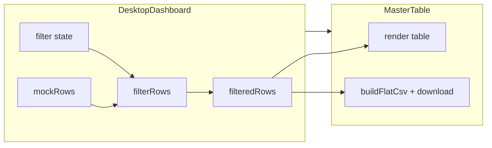

# План: активные фильтры и экспорт CSV

## Текущее состояние

- В [frontend/src/pages/DesktopDashboard.tsx](frontend/src/pages/DesktopDashboard.tsx) строка «Фильтры: Потеряшки · Ожидают действий · По тегам» — статичный текст.
- В [frontend/src/components/MasterTable.tsx](frontend/src/components/MasterTable.tsx) кнопка «Скачать CSV» без `onClick` и логики.
- Данные — один массив `mockRows` (ParcelRow[]), фильтрация не применяется.

## Целевое поведение (по System Design §4.1 и §3.4)

- **Потеряшки:** посылки, у которых статус не обновлялся более 30 дней (`tracking_updated_at` или давно без изменений).
- **Ожидают действий:** заказы/посылки с дедлайном защиты &lt; 5 дней или требующие внимания (например, не все товары получены).
- **По тегам:** показывать только строки, у которых хотя бы один товар имеет выбранный тег (например, #gift).
- **Скачать CSV:** плоский отчёт — одна строка на товар. Поля: Date, Order ID, Item Name, Tags, Price (Original), Price (Base), Tracking, Status (как в §3.4).

---

## 1. Фильтры: состояние и UI

**Где:** [frontend/src/pages/DesktopDashboard.tsx](frontend/src/pages/DesktopDashboard.tsx).

- Завести состояние фильтров:
  - `lostFilter: boolean` — включён ли «Потеряшки».
  - `actionRequiredFilter: boolean` — «Ожидают действий».
  - `selectedTag: string | null` — выбранный тег (или мультивыбор тегов, если нужно; для первого шага достаточно один тег).
- Рядом с заголовком заменить статичный текст на кликабельные элементы:
  - Чипы/кнопки: «Потеряшки», «Ожидают действий» (toggle по клику, визуально активный — другой стиль).
  - Для тегов: либо выпадающий список уникальных тегов из данных, либо клик по тегу в таблице как фильтр (проще — выпадающий список или набор чипов с тегами из `mockRows`).
- Функция `filterRows(rows: ParcelRow[]): ParcelRow[]`:
  - **Потеряшки:** оставлять только посылки, у которых `parcel.tracking_updated_at` старше 30 дней от текущей даты (или при отсутствии даты — по `parcel.status` «In_Transit»/«Created» и давно без обновлений; для мока можно считать от `tracking_updated_at`).
  - **Ожидают действий:** оставлять посылки/заказы, у которых `order.protection_end_date` через &lt; 5 дней ИЛИ есть товары с `quantity_received < quantity_ordered`.
  - **По тегам:** при `selectedTag` оставлять только те ParcelRow, у которых хотя бы один `orderItem.tags` содержит `selectedTag`.
- Передавать в `MasterTable` уже отфильтрованный массив: `rows={filteredRows}`.

Дополнительно: расширить мок в `DesktopDashboard` — добавить вторую посылку (например, «потеряшка» с старой датой и другой тег), чтобы все три фильтра было удобно проверить.

---

## 2. Экспорт CSV

**Где:** [frontend/src/components/MasterTable.tsx](frontend/src/components/MasterTable.tsx) (или вынести утилиту в `frontend/src/utils/exportCsv.ts`).

- Формат плоского CSV по §3.4: одна строка на товар (OrderItem). Заголовок и колонки, например:
  - `Date` — дата заказа (order.order_date).
  - `Order ID` — order.order_number_external.
  - `Item Name` — item_name.
  - `Tags` — теги через запятую или пробел (одно представление).
  - `Price (Original)` — price_original + currency_original.
  - `Price (Base)` — price_final_base.
  - `Tracking` — parcel.tracking_number.
  - `Status` — item_status (или parcel status; в доке — статус в контексте экспорта; разумно — item_status).
- Реализация:
  - Функция `buildFlatCsv(rows: ParcelRow[]): string` — обход `rows` и их `orderItems`, формирование строк с экранированием полей для CSV (кавычки, запятые, переносы).
  - Кнопка «Скачать CSV»: по клику вызывать `buildFlatCsv(rows)`, создавать `Blob` + временную ссылку `download` с именем файла вида `parcels-export-YYYY-MM-DD.csv`.
- Экспортировать нужно те же данные, что видны в таблице: передать в `MasterTable` текущие (уже отфильтрованные) `rows` и использовать их для CSV, чтобы экспорт соответствовал отображаемым данным.

---

## 3. Порядок работ и файлы

| Шаг | Действие                                                                          | Файлы                                                                              |
| --- | --------------------------------------------------------------------------------- | ---------------------------------------------------------------------------------- |
| 1   | Добавить утилиту построения плоского CSV и скачивания                             | Новый файл `frontend/src/utils/exportCsv.ts` (или рядом с таблицей).               |
| 2   | В MasterTable подключить экспорт к кнопке «Скачать CSV» (передать текущие `rows`) | [frontend/src/components/MasterTable.tsx](frontend/src/components/MasterTable.tsx) |
| 3   | В DesktopDashboard ввести состояние фильтров и UI (чипы/кнопки + выбор тега)      | [frontend/src/pages/DesktopDashboard.tsx](frontend/src/pages/DesktopDashboard.tsx) |
| 4   | Реализовать `filterRows` и передавать `filteredRows` в MasterTable                | [frontend/src/pages/DesktopDashboard.tsx](frontend/src/pages/DesktopDashboard.tsx) |
| 5   | Расширить mock (вторая посылка: старая дата, другой тег) для проверки фильтров    | [frontend/src/pages/DesktopDashboard.tsx](frontend/src/pages/DesktopDashboard.tsx) |

Бэкенд не трогаем; данные остаются моковыми. Позже загрузку данных и экспорт можно перевести на API (например, GET для списка, отдельный endpoint для CSV при большом объёме).

---

## Схема потока данных

