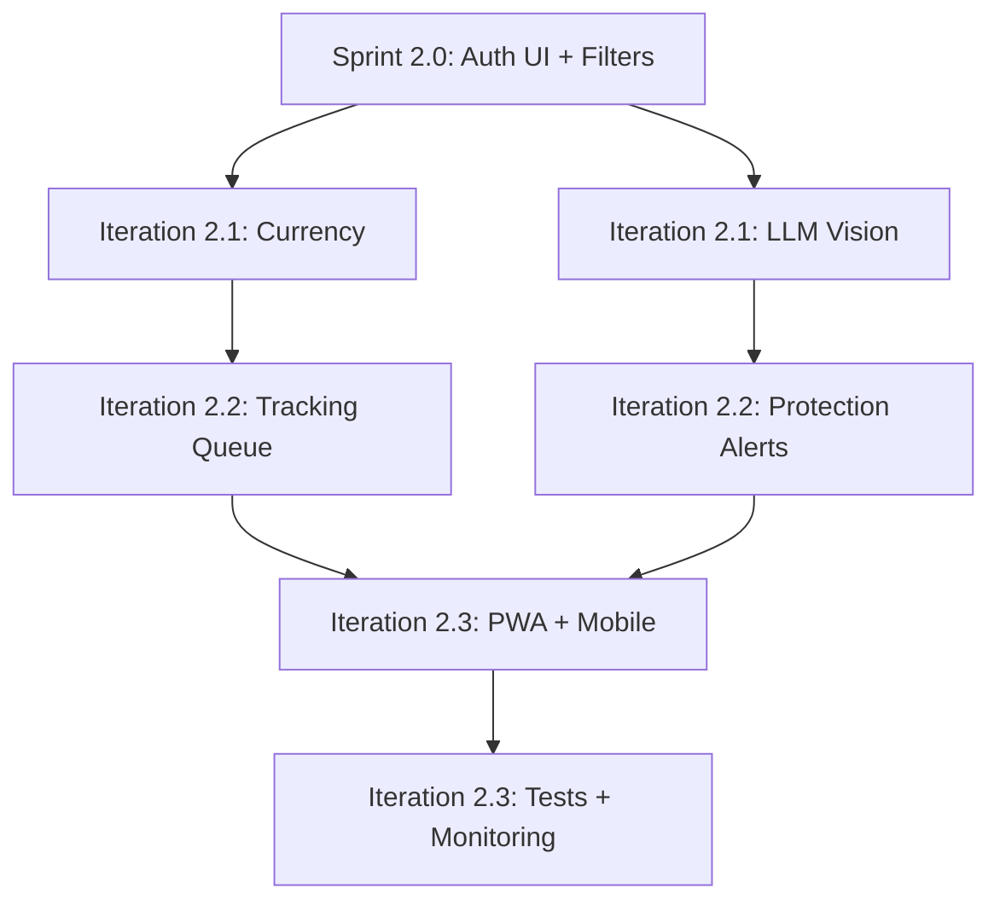

# ROADMAP: Итерации 2.1-2.3 — Advanced Features & Scale

**Проект:** BM Smart Parcel Tracker  
**Временной горизонт:** 2-4 месяца после Спринта 2.0  
**Статус:** Долгосрочное планирование  
**Дата:** 14 февраля 2026

---

## Контекст

Этот документ описывает долгосрочные планы развития проекта после завершения Спринта 2.0 (user-facing features). Включает бизнес-логику (Currency, LLM Vision), автоматизацию (Tracking queue), мобильные фичи (PWA, barcode scanner) и quality improvements (тесты, мониторинг).

---

## Итерация 2.1: Business Logic Modules (3-4 недели)

**Фокус:** Модули валют и LLM Vision для автоматизации ввода данных.

### Task 2.1.1: Currency Module (CBR API)

**Цель:** Автоматическая конвертация валют с замороженным курсом.

**Design Spec (из System Design Audit):**
- `Order` имеет `price_original`, `currency_original`, `exchange_rate_frozen`, `price_final_base`
- При создании заказа: если `currency_original != user.main_currency`, то получить курс с ЦБ РФ API
- Заморозить курс в `exchange_rate_frozen` (не пересчитывать при изменении курса)
- Флаг `is_price_estimated` = true, если курс получен автоматически (пользователь может override)

#### Backend

**Файлы:**
- `backend/app/services/currency_service.py` (новый)
- `backend/app/core/config.py` (уже есть `cbr_api_url`)

**Interface:**
```python
# backend/app/services/currency_service.py

import httpx
from app.core.config import settings

async def get_exchange_rate(
    from_currency: str, 
    to_currency: str,
    date: str | None = None  # YYYY-MM-DD, default = today
) -> float:
    """
    Get exchange rate from CBR API.
    Returns rate such that: amount_in_to_currency = amount_in_from_currency * rate
    
    Example: get_exchange_rate("USD", "RUB") -> 75.5 (1 USD = 75.5 RUB)
    
    Raises:
        httpx.HTTPError if API is unavailable
        ValueError if currency not found
    """
    async with httpx.AsyncClient() as client:
        url = settings.cbr_api_url  # https://www.cbr-xml-daily.ru/daily_json.js
        response = await client.get(url)
        response.raise_for_status()
        data = response.json()
        
        # CBR API format: {Valute: {USD: {Value: 75.5, ...}, EUR: {...}}}
        # Base currency is RUB
        
        if to_currency == "RUB":
            # Converting from foreign to RUB
            valute = data["Valute"].get(from_currency)
            if not valute:
                raise ValueError(f"Currency {from_currency} not found")
            return valute["Value"]
        elif from_currency == "RUB":
            # Converting from RUB to foreign
            valute = data["Valute"].get(to_currency)
            if not valute:
                raise ValueError(f"Currency {to_currency} not found")
            return 1.0 / valute["Value"]
        else:
            # Cross-rate (e.g. USD -> EUR)
            usd_to_rub = data["Valute"][from_currency]["Value"]
            eur_to_rub = data["Valute"][to_currency]["Value"]
            return usd_to_rub / eur_to_rub
```

**Integration в Order Creation:**

**Файлы:**
- `backend/app/services/order_service.py` (обновить)

```python
async def create_order(
    db: AsyncSession, 
    order_data: OrderCreate, 
    user: User
) -> Order:
    """Create order with automatic currency conversion."""
    
    # If currency is different from user's main currency, get exchange rate
    if order_data.currency_original != user.main_currency:
        try:
            rate = await get_exchange_rate(
                order_data.currency_original, 
                user.main_currency
            )
            exchange_rate_frozen = rate
            is_price_estimated = True
        except Exception as e:
            # Fallback: use 1.0 (no conversion) and mark as estimated
            logger.warning(f"Failed to get exchange rate: {e}")
            exchange_rate_frozen = 1.0
            is_price_estimated = True
    else:
        # Same currency, no conversion needed
        exchange_rate_frozen = 1.0
        is_price_estimated = False
    
    price_final_base = order_data.price_original * exchange_rate_frozen
    
    order = Order(
        user_id=user.id,
        platform=order_data.platform,
        order_number_external=order_data.order_number_external,
        order_date=order_data.order_date,
        protection_end_date=order_data.protection_end_date,
        price_original=order_data.price_original,
        currency_original=order_data.currency_original,
        exchange_rate_frozen=exchange_rate_frozen,
        price_final_base=price_final_base,
        is_price_estimated=is_price_estimated,
        comment=order_data.comment
    )
    
    db.add(order)
    await db.commit()
    await db.refresh(order)
    return order
```

**Frontend:**

**Файлы:**
- `frontend/src/pages/OrderForm.tsx` (новый — ручное создание заказа)

**UI:**
- Поле `price_original` + dropdown `currency_original` (RUB/USD/EUR)
- После заполнения показывать `price_final_base` (auto-calculated от backend)
- Если `is_price_estimated`, показывать иконку "ℹ️" с tooltip "Курс загружен автоматически, вы можете изменить его вручную"

**Manual Override:**
- Кнопка "Изменить курс вручную" → показывает input для `exchange_rate_frozen`
- При изменении `is_price_estimated` = false

**Test Strategy:**
- Mock CBR API response в тестах
- Тесты:
  - `test_get_exchange_rate_usd_to_rub`
  - `test_get_exchange_rate_rub_to_usd`
  - `test_get_exchange_rate_cross_rate`
  - `test_create_order_with_conversion` (USD → RUB)
  - `test_create_order_same_currency` (RUB → RUB, rate = 1.0)
  - `test_create_order_api_failure` (fallback rate = 1.0)

---

### Task 2.1.2: LLM Vision Import Pipeline (Gemini)

**Цель:** Парсинг скриншотов заказов (AliExpress, Ozon, etc.) в структурированные данные.

**Design Spec (из System Design Audit):**
- User загружает screenshot
- Backend отправляет в Gemini Vision API с промптом
- LLM возвращает JSON: `[{order_number_external, order_date, items: [{name, price, quantity, tags}]}]`
- Backend дедуплицирует заказы по `order_number_external` (не создавать дубли)
- Backend определяет валюту из символа ($ → USD, € → EUR, ₽ → RUB)
- Возвращает preview для подтверждения пользователем

#### Backend

**Файлы:**
- `backend/app/services/vision_service.py` (новый)
- `backend/app/api/vision.py` (новый)

**Vision Service Interface:**

```python
# backend/app/services/vision_service.py

import base64
import hashlib
import google.generativeai as genai
from app.core.config import settings

genai.configure(api_key=settings.GEMINI_API_KEY)

async def parse_order_screenshot(
    image_bytes: bytes,
    user_id: str
) -> dict:
    """
    Parse order screenshot using Gemini Vision.
    
    Returns:
        {
            "orders": [
                {
                    "order_number_external": "123456789",
                    "order_date": "2024-01-15",
                    "platform": "AliExpress",
                    "price_original": 150.0,
                    "currency_original": "USD",
                    "items": [
                        {
                            "item_name": "iPhone Case",
                            "quantity_ordered": 2,
                            "tags": ["electronics", "phone"]
                        }
                    ]
                }
            ]
        }
    """
    
    # Idempotency: hash image to avoid duplicate processing
    image_hash = hashlib.sha256(image_bytes).hexdigest()
    # TODO: Check if this hash was processed before (store in DB or Redis)
    
    # Encode image to base64
    image_b64 = base64.b64encode(image_bytes).decode()
    
    # Gemini Vision prompt
    prompt = """
    Parse this order screenshot and extract structured data.
    
    Return JSON in this format:
    {
      "orders": [
        {
          "order_number_external": "string",
          "order_date": "YYYY-MM-DD",
          "platform": "AliExpress|Ozon|Wildberries|Other",
          "price_original": number,
          "currency_original": "USD|EUR|RUB",
          "items": [
            {
              "item_name": "string",
              "quantity_ordered": number,
              "tags": ["string"]
            }
          ]
        }
      ]
    }
    
    Rules:
    - If multiple orders on one screenshot, return multiple orders
    - Infer currency from symbols: $ = USD, € = EUR, ₽ = RUB
    - Suggest tags based on item name (e.g. "electronics", "clothing", "gift")
    - If field is missing, omit it (don't guess)
    """
    
    model = genai.GenerativeModel('gemini-1.5-flash')
    response = model.generate_content([
        prompt,
        {"mime_type": "image/jpeg", "data": image_b64}
    ])
    
    # Parse JSON response
    import json
    result = json.loads(response.text)
    
    return result
```

**API Endpoint:**

```python
# backend/app/api/vision.py

from fastapi import APIRouter, Depends, UploadFile, File
from app.services.vision_service import parse_order_screenshot
from app.api.users import get_current_active_user

router = APIRouter(prefix="/api/vision", tags=["vision"])

@router.post("/parse-order")
async def upload_order_screenshot(
    file: UploadFile = File(...),
    current_user: User = Depends(get_current_active_user)
):
    """
    Upload order screenshot for parsing.
    Returns preview of extracted data (user must confirm before creating orders).
    """
    image_bytes = await file.read()
    
    result = await parse_order_screenshot(image_bytes, str(current_user.id))
    
    # Check for duplicates
    for order_data in result["orders"]:
        existing = await get_order_by_external_number(
            db, 
            current_user.id, 
            order_data["order_number_external"]
        )
        if existing:
            order_data["_duplicate"] = True
            order_data["_existing_order_id"] = str(existing.id)
    
    return {
        "preview": result,
        "message": "Review and confirm to create orders"
    }

@router.post("/confirm-orders")
async def confirm_parsed_orders(
    orders_data: list[dict],
    current_user: User = Depends(get_current_active_user),
    db: AsyncSession = Depends(get_db)
):
    """
    Create orders from confirmed preview.
    """
    created_orders = []
    
    for order_data in orders_data:
        # Skip duplicates
        if order_data.get("_duplicate"):
            continue
        
        # Create order
        order = await order_service.create_order(
            db, 
            OrderCreate(**order_data),
            current_user
        )
        
        # Create order items
        for item_data in order_data["items"]:
            await order_item_service.create_order_item(
                db,
                OrderItemCreate(
                    order_id=order.id,
                    item_name=item_data["item_name"],
                    quantity_ordered=item_data["quantity_ordered"],
                    tags=item_data.get("tags", []),
                    item_status="Waiting_Shipment"
                )
            )
        
        created_orders.append(order)
    
    return {
        "created_orders": len(created_orders),
        "orders": [OrderRead.from_orm(o) for o in created_orders]
    }
```

#### Frontend

**Файлы:**
- `frontend/src/pages/ImportOrder.tsx` (новый)

**UI Flow:**
1. Кнопка "Загрузить скриншот"
2. File input → upload → POST /api/vision/parse-order
3. Показать preview таблицу:
   - Колонки: Order ID, Date, Platform, Items, Price
   - Строки с ⚠️ если duplicate
4. Кнопка "Подтвердить и создать заказы"
5. POST /api/vision/confirm-orders → редирект на DesktopDashboard

**Test Strategy:**
- Backend: mock Gemini API response
- Тесты:
  - `test_parse_order_screenshot_success`
  - `test_parse_order_screenshot_invalid_json`
  - `test_confirm_orders_skip_duplicates`
  - `test_currency_inference` ($ → USD, € → EUR)

---

### Task 2.1.3: Vision Idempotency

**Проблема:** Если пользователь загружает один и тот же screenshot дважды, не нужно снова вызывать LLM API.

**Решение:**
- Вычислять SHA256 hash от image bytes
- Хранить в таблице `vision_cache`:
  - `image_hash` (primary key)
  - `user_id`
  - `result_json` (parsed orders)
  - `created_at`
- При upload проверять, есть ли hash в кеше (для этого user_id)
- Если есть — возвращать cached result
- TTL: 30 дней (автоматически удалять старые записи)

**Файлы:**
- `backend/app/models/vision_cache.py` (новый)
- `backend/alembic/versions/003_add_vision_cache.py` (новая миграция)
- `backend/app/services/vision_service.py` (обновить)

**Test Strategy:**
- `test_vision_cache_hit` (загрузить дважды → второй раз быстрее, без LLM call)
- `test_vision_cache_miss` (разные изображения → оба вызывают LLM)

---

## Итерация 2.2: Tracking & Automation (3-4 недели)

**Фокус:** Автоматическое отслеживание посылок, очереди, уведомления.

### Task 2.2.1: Tracking Queue (Redis + Celery)

**Цель:** Автоматически обновлять статус посылок через carrier API без блокировки UI.

**Design Spec:**
- Celery worker с задачей `update_parcel_tracking(parcel_id)`
- Приоритеты:
  - **High:** Посылки в статусе `In_Transit` или `PickUp_Ready`, обновлялись < 24 часа назад
  - **Normal:** `In_Transit`, обновлялись 1-7 дней назад
  - **Low:** `In_Transit`, обновлялись 7-30 дней назад
  - **Frozen:** `Delivered`, `Lost`, `Archived` или не обновлялись > 30 дней
- Scheduler (Celery Beat): проверять каждые 1 час (High), 6 часов (Normal), 24 часа (Low)

#### Backend

**Dependencies:**
```txt
# backend/requirements.txt (добавить)
celery[redis]>=5.3.0
redis>=5.0.0
```

**Файлы:**
- `backend/app/worker.py` (новый)
- `backend/app/tasks/tracking.py` (новый)
- `backend/app/services/tracking_service.py` (новый)

**Tracking Service:**

```python
# backend/app/services/tracking_service.py

import httpx
from app.models.parcel import Parcel, ParcelStatus

async def update_parcel_tracking(parcel: Parcel) -> Parcel:
    """
    Fetch tracking info from carrier API and update parcel.
    
    Carrier APIs (examples):
    - CDEK: https://api.cdek.ru/v2/orders/{tracking_number}/statuses
    - Russian Post: https://tracking.pochta.ru/tracking/{tracking_number}
    - DHL: https://api-eu.dhl.com/track/shipments?trackingNumber={tracking_number}
    
    Returns updated parcel.
    """
    
    # Carrier-specific logic
    carrier_slug = parcel.carrier_slug
    tracking_number = parcel.tracking_number
    
    if carrier_slug == "cdek":
        # CDEK API example
        async with httpx.AsyncClient() as client:
            response = await client.get(
                f"https://api.cdek.ru/v2/orders/{tracking_number}/statuses",
                headers={"Authorization": f"Bearer {CDEK_API_KEY}"}
            )
            data = response.json()
            
            # Map CDEK status to our ParcelStatus
            cdek_status = data["statuses"][-1]["code"]
            if cdek_status == "DELIVERED":
                parcel.status = ParcelStatus.Delivered
            elif cdek_status in ["IN_TRANSIT", "ACCEPTED"]:
                parcel.status = ParcelStatus.In_Transit
            # ... more mappings
            
            parcel.tracking_updated_at = datetime.now(UTC)
    
    # ... other carriers (Russian Post, DHL, etc.)
    
    return parcel
```

**Celery Task:**

```python
# backend/app/tasks/tracking.py

from celery import Celery
from app.core.config import settings
from app.core.database import AsyncSession, engine
from app.services import parcel_service, tracking_service

celery_app = Celery("bm_smart_parcel", broker=settings.redis_url)

@celery_app.task
async def update_parcel_tracking_task(parcel_id: str):
    """Update parcel tracking status."""
    async with AsyncSession(engine) as db:
        parcel = await parcel_service.get_parcel_by_id(db, parcel_id)
        if not parcel:
            return {"error": "Parcel not found"}
        
        updated_parcel = await tracking_service.update_parcel_tracking(parcel)
        await db.commit()
        
        return {"parcel_id": str(parcel.id), "status": updated_parcel.status}
```

**Celery Beat Schedule:**

```python
# backend/app/worker.py

from celery.schedules import crontab

celery_app.conf.beat_schedule = {
    'update-high-priority-parcels': {
        'task': 'app.tasks.tracking.enqueue_high_priority_parcels',
        'schedule': crontab(minute=0),  # Every hour
    },
    'update-normal-priority-parcels': {
        'task': 'app.tasks.tracking.enqueue_normal_priority_parcels',
        'schedule': crontab(minute=0, hour='*/6'),  # Every 6 hours
    },
    'update-low-priority-parcels': {
        'task': 'app.tasks.tracking.enqueue_low_priority_parcels',
        'schedule': crontab(minute=0, hour=0),  # Daily at midnight
    },
}
```

**Docker Compose Update:**

```yaml
# docker-compose.yml (добавить)

  celery-worker:
    build: ./backend
    command: celery -A app.worker worker --loglevel=info
    depends_on:
      - redis
      - db
    environment:
      DATABASE_URL: ${DATABASE_URL}
      REDIS_URL: ${REDIS_URL}
  
  celery-beat:
    build: ./backend
    command: celery -A app.worker beat --loglevel=info
    depends_on:
      - redis
    environment:
      REDIS_URL: ${REDIS_URL}
```

**Test Strategy:**
- Mock carrier API responses
- Тесты:
  - `test_update_parcel_tracking_cdek`
  - `test_update_parcel_tracking_russian_post`
  - `test_celery_task_updates_status`
  - `test_priority_queue` (High priority parcels scheduled before Low)

---

### Task 2.2.2: Protection Deadline Alerts

**Цель:** Уведомлять пользователя, когда срок защиты истекает < 2 дней.

**Implementation:**
- Celery task `check_protection_deadlines` (daily at 9:00 AM)
- Для каждого user: найти orders с `protection_end_date` < 2 дня
- Отправить email или push notification (PWA)
- Хранить в таблице `notifications` (чтобы не спамить ежедневно)

**Файлы:**
- `backend/app/tasks/notifications.py` (новый)
- `backend/app/models/notification.py` (новый)

**Test Strategy:**
- Mock email sender
- Тесты:
  - `test_alert_sent_for_expiring_order`
  - `test_no_duplicate_alerts`

---

### Task 2.2.3: Rate Limiting (slowapi)

**Цель:** Защитить API от злоупотреблений (брутфорс login, спам requests).

**Implementation:**

```python
# backend/app/main.py

from slowapi import Limiter, _rate_limit_exceeded_handler
from slowapi.util import get_remote_address
from slowapi.errors import RateLimitExceeded

limiter = Limiter(key_func=get_remote_address)
app.state.limiter = limiter
app.add_exception_handler(RateLimitExceeded, _rate_limit_exceeded_handler)

# Apply to auth endpoints
@app.post("/api/auth/login")
@limiter.limit("5/minute")
async def login(...):
    ...
```

**Limits:**
- `/api/auth/login`: 5 req/min per IP
- `/api/auth/register`: 3 req/min per IP
- Other endpoints: 100 req/min per IP

---

## Итерация 2.3: Mobile & Quality (3-4 недели)

**Фокус:** Mobile UX, PWA, тестирование, мониторинг.

### Task 2.3.1: PWA Enhancements

**Цель:** Offline mode, install prompt, push notifications.

**Features:**
1. **Service Worker** для offline caching
2. **Install prompt** (Add to Home Screen)
3. **Push notifications** (protection alerts, tracking updates)

**Файлы:**
- `frontend/public/service-worker.js` (новый)
- `frontend/public/manifest.json` (уже есть, обновить)
- `frontend/src/utils/registerSW.ts` (новый)

**Test Strategy:**
- Manual: открыть в Chrome DevTools → Application → Service Workers
- Проверить offline mode (отключить сеть, страница должна загрузиться из cache)

---

### Task 2.3.2: Barcode Scanner (Mobile)

**Цель:** Сканировать tracking number штрихкодом (камера).

**Library:** `@zxing/browser` или `react-qr-reader`

**UI:**
- FAB кнопка (Floating Action Button) "Сканировать"
- Открывает камеру
- Распознает barcode → автоматически ищет посылку по tracking_number
- Если найдена → показать "Содержимое посылки" (список order items с checkboxes)
- Кнопка "Принять выбранное" → обновить `quantity_received`

**Файлы:**
- `frontend/src/pages/ScanParcel.tsx` (новый)
- `frontend/src/components/BarcodeScanner.tsx` (новый)

**Test Strategy:**
- Manual на мобильном устройстве
- Печатать barcode с tracking number → сканировать → проверить что посылка найдена

---

### Task 2.3.3: Frontend Test Suite (Vitest + Testing Library)

**Цель:** Unit и integration тесты для frontend.

**Dependencies:**
```json
// frontend/package.json (добавить)
{
  "devDependencies": {
    "vitest": "^1.0.0",
    "@testing-library/react": "^14.0.0",
    "@testing-library/jest-dom": "^6.0.0",
    "@testing-library/user-event": "^14.0.0",
    "msw": "^2.0.0"
  }
}
```

**Test Coverage Target:** 60%+

**Примеры тестов:**
- `Login.test.tsx`: рендер формы, submit, показ ошибок
- `MasterTable.test.tsx`: render rows, expand/collapse, filters
- `exportCsv.test.ts`: генерация CSV, escaping
- `useAuth.test.ts`: login, logout, token management

**CI Integration:**
```yaml
# .github/workflows/ci.yml (обновить)

  frontend-test:
    name: Frontend Tests
    runs-on: ubuntu-latest
    steps:
      - uses: actions/checkout@v4
      - name: Set up Node.js
        uses: actions/setup-node@v4
        with:
          node-version: '20'
      - name: Install dependencies
        working-directory: ./frontend
        run: npm ci
      - name: Run tests
        working-directory: ./frontend
        run: npm test -- --coverage
```

---

### Task 2.3.4: Monitoring & Observability

**Цель:** Sentry для ошибок, Prometheus для метрик.

#### Sentry (Error Tracking)

**Backend:**
```python
# backend/app/main.py

import sentry_sdk
from sentry_sdk.integrations.fastapi import FastApiIntegration

if settings.SENTRY_DSN:
    sentry_sdk.init(
        dsn=settings.SENTRY_DSN,
        integrations=[FastApiIntegration()],
        traces_sample_rate=0.1,
        environment="production"
    )
```

**Frontend:**
```typescript
// frontend/src/main.tsx

import * as Sentry from "@sentry/react";

if (import.meta.env.PROD) {
  Sentry.init({
    dsn: "https://...",
    integrations: [new Sentry.BrowserTracing()],
    tracesSampleRate: 0.1,
  });
}
```

#### Prometheus (Metrics)

**Backend:**
```python
# backend/app/main.py

from prometheus_fastapi_instrumentator import Instrumentator

Instrumentator().instrument(app).expose(app, endpoint="/metrics")
```

**Docker Compose:**
```yaml
  prometheus:
    image: prom/prometheus:latest
    volumes:
      - ./prometheus.yml:/etc/prometheus/prometheus.yml
    ports:
      - "9090:9090"
  
  grafana:
    image: grafana/grafana:latest
    ports:
      - "3000:3000"
    environment:
      - GF_SECURITY_ADMIN_PASSWORD=admin
```

---

## Backlog / Техдолг

Задачи, отложенные после выбора стратегии «сначала polling»; при необходимости — реализация для более «живой» синхронизации и мобильного опыта.

**1. SSE (Server-Sent Events) для пуш-обновлений**
- Односторонний канал сервер → клиент: при изменении данных (трекинг, правки с другого устройства) сервер шлёт событие, клиент инвалидирует кеш или обновляет сущность.
- Требует: endpoint SSE, привязка к user_id, вызов рассылки из сервисов при мутациях (или из фоновых задач).
- Сложность: средняя. Имеет смысл после стабилизации polling и при запросе на «мгновенную» синхронизацию.

**2. PWA (offline, push-уведомления)**
- Offline: кеш статики и опционально API-ответов (например, список посылок), работа без сети с ограничениями.
- Push: уведомления при закрытой вкладке (например, «посылка доставлена») через Service Worker + FCM или аналог.
- Требует: манифест, Service Worker, подписка на push (VAPID), бэкенд-интеграция при событиях.
- Сложность: выше. Отнесено в техдолг; приоритет после MVP.

---

## Приоритизация итераций

### Высокий приоритет (Must-Have)

**Iteration 2.1:**
- Currency module (критично для multi-currency orders)
- LLM Vision import (ключевая фича для автоматизации)

**Iteration 2.2:**
- Tracking queue (автоматизация, снижает ручной труд)
- Protection alerts (предотвращает потерю денег)

### Средний приоритет (Should-Have)

**Iteration 2.2:**
- Rate limiting (security, но MVP может работать без него)

**Iteration 2.3:**
- PWA offline mode (nice-to-have для mobile)
- Barcode scanner (удобство, но не критично)

### Низкий приоритет (Nice-to-Have)

**Iteration 2.3:**
- Frontend tests (quality improvement, но можно отложить)
- Monitoring (полезно для production, но не блокирует MVP)

---

## Метрики и KPI

### Технические метрики

**Backend:**
- Test coverage: ≥ 70%
- Ruff linting: 0 ошибок
- API response time (p95): < 500ms
- Celery task success rate: > 95%

**Frontend:**
- Test coverage: ≥ 60%
- Bundle size: < 400 KB (gzipped)
- Lighthouse score (mobile): > 90

**Infrastructure:**
- CI/CD pipeline time: < 10 минут
- Uptime: > 99.5%

### Бизнес-метрики

- Время ввода одного заказа (manual): < 2 минут
- Время ввода через Vision: < 30 секунд
- Точность LLM парсинга: > 85% (field accuracy)
- Пользователи с ≥ 1 alert: > 50% (вовлеченность)

---

## Риски и митигация

### Технические риски

**1. LLM Vision API нестабилен (downtime, rate limits)**
- **Вероятность:** Средняя
- **Митигация:**
  - Fallback на ручной ввод
  - Retry logic с exponential backoff
  - Caching parsed results (idempotency)

**2. Carrier tracking API меняют формат или блокируют**
- **Вероятность:** Высокая (исторически это случалось)
- **Митигация:**
  - Adapter pattern для каждого carrier
  - Мониторинг failed requests
  - Graceful degradation (показывать последний известный статус)

**3. Celery queue переполняется (thousands of parcels)**
- **Вероятность:** Низкая (на MVP < 100 посылок)
- **Митигация:**
  - Rate limiting на enqueue
  - Horizontal scaling (multiple workers)
  - Dead letter queue для failed tasks

### Бизнес-риски

**1. Пользователи не хотят загружать скриншоты (privacy concerns)**
- **Митигация:**
  - Disclosure: "Данные обрабатываются только для парсинга, не сохраняются"
  - Альтернатива: manual input всегда доступен

**2. Низкая точность LLM (много ручных правок)**
- **Митигация:**
  - Preview перед созданием заказов (пользователь подтверждает)
  - Fine-tuning промптов на реальных данных
  - Fallback на более мощную модель (GPT-4o) если Gemini не справляется

---

## Зависимости между итерациями



**Критический путь:**
1. Sprint 2.0 (Auth UI) — необходимо для всех фич
2. Iteration 2.1 (Currency + Vision) — core business logic
3. Iteration 2.2 (Tracking) — automation
4. Iteration 2.3 (Mobile + Quality) — polish

---

## После Iteration 2.3

**Что будет готово:**
- Полностью рабочее приложение с автоматизацией (LLM, tracking)
- Mobile-first UX (PWA, barcode scanner)
- Production-grade quality (тесты, мониторинг, rate limiting)

**Что можно добавить дальше (Iteration 3.0+):**
- Admin panel (управление пользователями, статистика)
- Multi-user support (команды, shared orders)
- Advanced analytics (dashboard с графиками, cost optimization)
- Интеграция с ERP/CRM
- API для сторонних приложений

---

## Приложение: Technology Stack

### Backend
- **Framework:** FastAPI 0.109+
- **ORM:** SQLAlchemy 2.0 (async)
- **Database:** PostgreSQL 16
- **Queue:** Celery 5.3 + Redis 7
- **LLM:** Google Gemini 1.5 Flash (или OpenAI GPT-4o)
- **Monitoring:** Sentry + Prometheus

### Frontend
- **Framework:** React 19
- **Build Tool:** Vite 7
- **Styling:** Tailwind CSS 4
- **Table:** TanStack Table 8
- **Testing:** Vitest + Testing Library
- **PWA:** Workbox (service worker)

### Infrastructure
- **Containerization:** Docker + Docker Compose
- **CI/CD:** GitHub Actions
- **Reverse Proxy:** Nginx (SSL, rate limiting, static files)
- **Secrets:** Docker secrets (prod) / env vars (dev)

---

**Документ подготовлен:** 14 февраля 2026  
**Автор:** AI Assistant (Claude Sonnet 4.5)  
**Версия:** 1.0  
**Статус:** Long-term Planning
