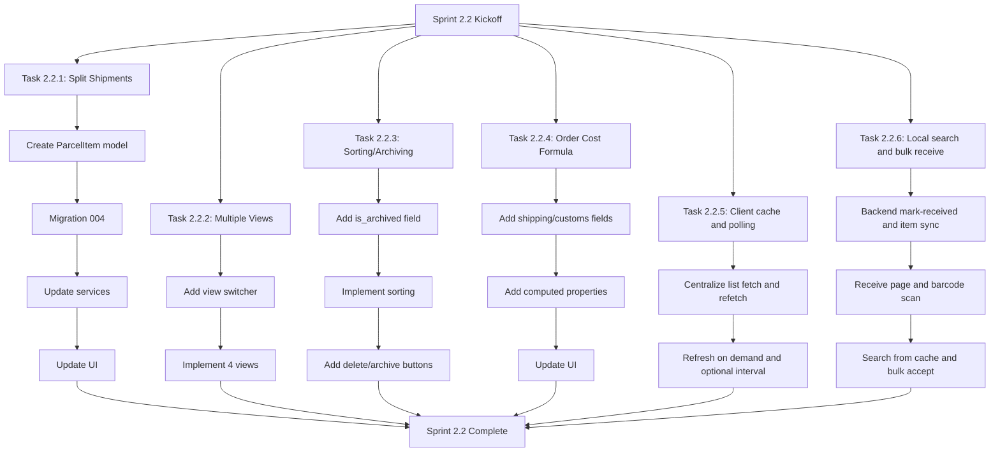
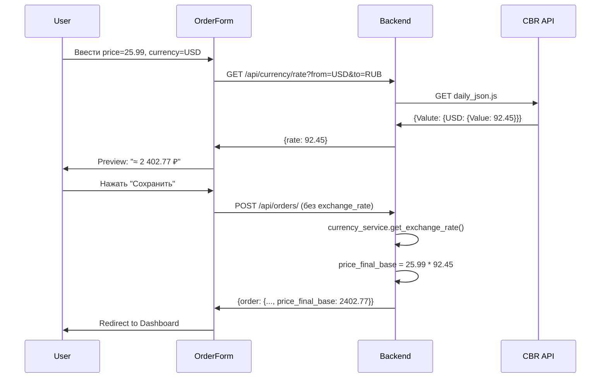
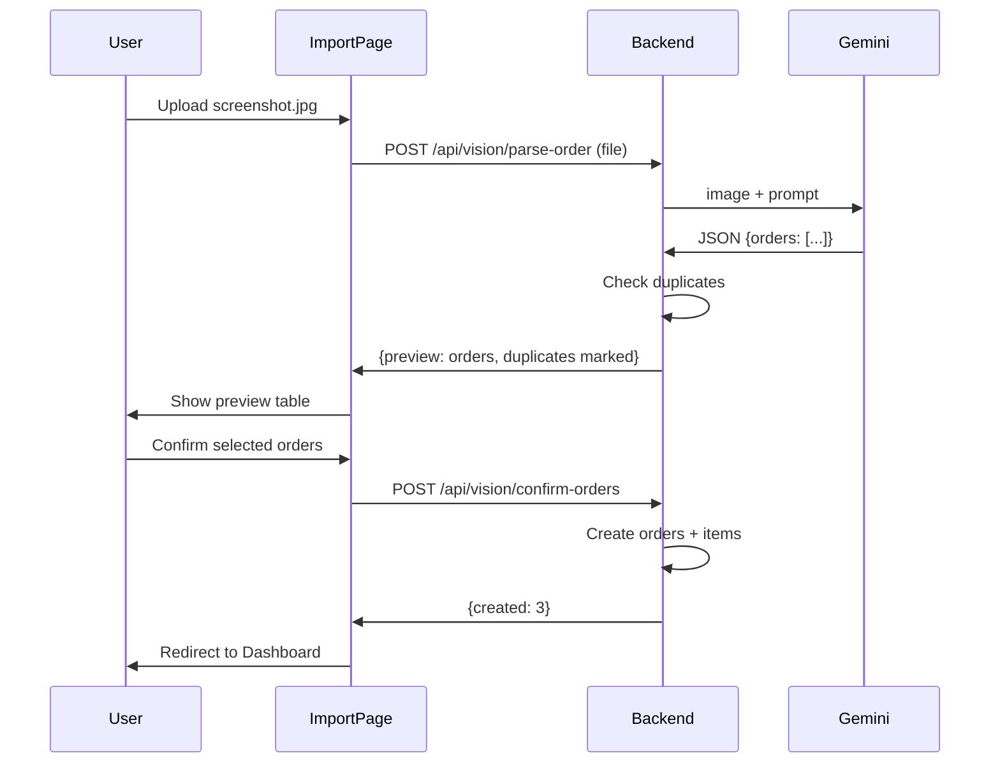
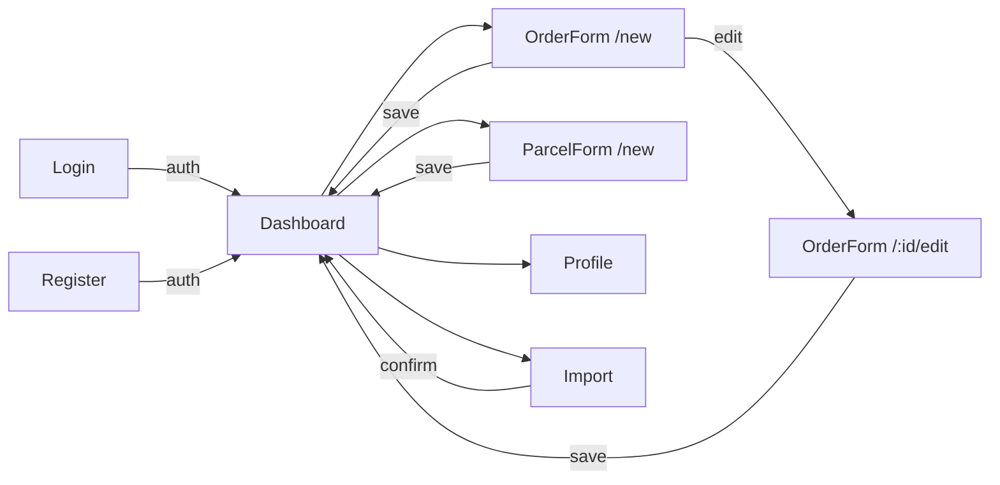

# ROADMAP: Спринт 2.1 — Data Entry & Business Logic

**Проект:** BM Smart Parcel Tracker  
**Длительность:** 3–4 недели (15–20 рабочих дней)  
**Фокус:** CRUD-формы на фронтенде, модуль валют (CBR API), LLM Vision Import  
**Статус:** ✅ COMPLETED  
**Дата начала:** 14 февраля 2026  
**Дата завершения:** 14 февраля 2026  
**Предыдущий спринт:** Sprint 2.0 — ✅ COMPLETED (Auth UI, Filters, CSV, OrderItem API)

---

## Контекст и предпосылки

### Что уже готово (Sprint 2.0)

**Backend:**
- FastAPI + SQLAlchemy 2.0 (async), PostgreSQL
- JWT аутентификация (bcrypt), protected endpoints
- CRUD сервисы: User, Order, Parcel, OrderItem (с authorization checks)
- Pydantic schemas для всех entity (Create/Read/Update/WithItems)
- Alembic миграции (2 миграции выполнены)
- 27+ pytest тестов проходят (100%): auth(7), orders(6), parcels(6), order_items(5), users(3)
- Ruff linting: 0 ошибок
- Config: `cbr_api_url`, `GEMINI_API_KEY`, `redis_url` уже в `Settings`

**Frontend:**
- React 19 + Vite 7 + Tailwind 4
- TanStack Table с expandable rows (Parcel → OrderItems)
- ProtectedRoute, Login, Register, Profile страницы
- API client с token management
- Hooks: useAuth, useOrders, useParcels, useCurrentUser
- DesktopDashboard: фильтры (Потеряшки, Ожидают действий, Теги), CSV export
- MasterTable: expand/collapse, protection deadline colors, tag pills

**Infrastructure:**
- Docker Compose (dev + prod), GitHub Actions CI/CD
- Nginx config, Logging (structured)

**Что НЕ готово (gaps):**
1. **Нет UI для создания/редактирования данных** — нет OrderForm, ParcelForm, OrderItemForm
2. **Нет навигации** — только кнопка "Выйти", нет меню/header nav
3. **Currency Module** — поля `exchange_rate_frozen`, `price_final_base` есть в модели, но заполняются вручную клиентом
4. **LLM Vision** — endpoint и сервис не реализованы (только конфиг `GEMINI_API_KEY` в Settings)
5. **Нет Dashboard метрик** — нет summary cards (всего заказов, потеряшек, сумма)

---

## Цели спринта 2.1

**Primary Goal:**  
Дать пользователю полноценный UI для ввода данных + автоматизировать валютную конвертацию + опциональный LLM импорт.

**Success Criteria:**
- Пользователь может создавать заказы, посылки и товары через UI-формы
- При создании заказа в иностранной валюте курс автоматически загружается с ЦБ РФ
- Пользователь может переопределить курс вручную (manual override)
- Навигация между страницами интуитивна (header nav)
- Dashboard показывает summary карточки (статистика)
- [Опционально] Импорт заказов из скриншота через Gemini Vision

---

## ✅ Что было выполнено

### Запланированные задачи (100% выполнено)

**Неделя 1: CRUD Forms + Navigation**
- ✅ Task 1.1: App Navigation / Layout — `frontend/src/components/AppLayout.tsx`
- ✅ Task 1.2: OrderForm Page — `frontend/src/pages/OrderForm.tsx`
- ✅ Task 1.3: ParcelForm Page — `frontend/src/pages/ParcelForm.tsx`
- ✅ Task 1.4: OrderItem Inline Add/Edit — интегрировано в OrderForm
- ✅ Task 1.5: Dashboard Summary Cards — добавлено в `DesktopDashboard.tsx`

**Неделя 2: Currency Module (CBR API)**
- ✅ Task 2.1: Currency Service — `backend/app/services/currency_service.py`
- ✅ Task 2.2: Order Service Auto-Conversion — обновлён `order_service.py`
- ✅ Task 2.3: Currency API Endpoint — `backend/app/api/currency.py`

**Неделя 3: LLM Vision Import**
- ⏸️ Task 3.x: Отложено на следующий спринт (опциональная задача)

### Дополнительные функции (не в плане, но реализованы)

Помимо запланированных задач, были реализованы критические улучшения:

**Модель данных:**
1. ✅ `price_per_item` — добавлено поле стоимости единицы товара в OrderItem
   - Миграция: `003_add_price_per_item_and_parcel_order_id.py`
   - Backend: модель, схема, сервис
   - Frontend: UI в OrderForm

2. ✅ `order_id` в Parcel — прямая связь посылки с заказом
   - Позволяет привязывать посылку к заказу при создании
   - UI: dropdown "Привязать к заказу" в ParcelForm

**UI/UX улучшения:**
3. ✅ Автоматический пересчёт в OrderForm:
   - Цена × Кол-во → Стоимость
   - Стоимость ÷ Кол-во → Цена за шт
   - Трёхстороннее связывание полей

4. ✅ Указание количества товара в посылке
   - Поддержка split shipments
   - UI: input "Кол-во в посылке" при выборе товара

5. ✅ Кнопка "Collapse All" в dashboard
   - Сворачивает/разворачивает все заказы одним кликом

6. ✅ Корректное отображение валют:
   - Заказы показывают оригинальную цену в оригинальной валюте
   - Общая сумма группируется по валютам: "165550 ₽ + 1500 $ + 300 €"

7. ✅ Фикс базовой валюты в OrderForm:
   - Автоматически предзаполняется из профиля пользователя

**Критические багфиксы:**
8. ✅ JWT timestamp serialization — `int(expire.timestamp())` вместо datetime
9. ✅ Order update validation — округление decimal до 2 знаков
10. ✅ Items visibility — загрузка items через `/orders?include_items=true`

---

## Архитектурные решения

### Новые маршруты фронтенда

```
/                    → DesktopDashboard (existing, protected)
/login               → Login (existing)
/register            → Register (existing)
/profile             → Profile (existing, protected)
/orders/new          → OrderForm (NEW, protected)
/orders/:id/edit     → OrderForm (NEW, protected)
/parcels/new         → ParcelForm (NEW, protected)
/parcels/:id/edit    → ParcelForm (NEW, protected)
/import              → ImportOrder (NEW, protected, optional)
```

### Currency Module: Data Flow

```
User заполняет OrderForm
  → price_original: 25.99
  → currency_original: USD
  → user.main_currency: RUB
  ↓
Frontend POST /api/orders/ (без exchange_rate_frozen)
  ↓
Backend order_service.create_order()
  → currency_service.get_exchange_rate("USD", "RUB")
  → CBR API: https://www.cbr-xml-daily.ru/daily_json.js
  → exchange_rate_frozen = 92.45
  → price_final_base = 25.99 * 92.45 = 2402.77
  → is_price_estimated = true
  ↓
Response → frontend показывает "≈ 2 402.77 ₽ (курс ЦБ)"
```

### Service Layer Update

```
order_service.create_order(db, user_id, order_data)
  ├── NEW: вызывает currency_service если нужна конвертация
  ├── Вычисляет price_final_base
  └── Сохраняет order
```

---

## Задачи спринта

### Неделя 1: CRUD Forms + Navigation

#### Task 1.1: App Navigation / Layout (1 день)

**Цель:** Добавить header с навигацией на все страницы.

**Файлы:**
- `frontend/src/components/AppLayout.tsx` (новый)
- `frontend/src/App.tsx` (обновить)

**Требования:**
- Компонент `AppLayout` оборачивает все protected routes
- Header: логотип "📦 Smart Parcel Tracker", nav links, user email, кнопка Logout
- Nav links: "Главная" (/), "Новый заказ" (/orders/new), "Новая посылка" (/parcels/new), "Профиль" (/profile)
- Responsive: на mobile — hamburger menu
- Active link подсвечивается

**Interface:**
```tsx
// frontend/src/components/AppLayout.tsx
export function AppLayout({ children }: { children: React.ReactNode }) {
  return (
    <div className="min-h-screen bg-slate-50 dark:bg-slate-900">
      <header> {/* nav links, user info, logout */} </header>
      <main className="p-4 md:p-6">{children}</main>
    </div>
  )
}
```

**Изменения в App.tsx:**
```tsx
<Route path="/" element={
  <ProtectedRoute>
    <AppLayout>
      <Outlet />
    </AppLayout>
  </ProtectedRoute>
}>
  <Route index element={<DesktopDashboard />} />
  <Route path="orders/new" element={<OrderForm />} />
  <Route path="orders/:id/edit" element={<OrderForm />} />
  <Route path="parcels/new" element={<ParcelForm />} />
  <Route path="parcels/:id/edit" element={<ParcelForm />} />
  <Route path="profile" element={<Profile />} />
  <Route path="import" element={<ImportOrder />} />
</Route>
```

**При этом:**
- Убрать header/logout из `DesktopDashboard.tsx` (перенести в AppLayout)
- `DesktopDashboard` становится чисто контентной страницей

**Test Strategy:**
- Manual: проверить навигацию между страницами, active state, mobile hamburger

---

#### Task 1.2: OrderForm Page (2 дня)

**Цель:** Форма создания/редактирования заказа.

**Файлы:**
- `frontend/src/pages/OrderForm.tsx` (новый)
- `frontend/src/hooks/useOrders.ts` (обновить — добавить `createOrder`, `updateOrder`)

**Режимы:**
- **Create:** URL `/orders/new`, пустая форма
- **Edit:** URL `/orders/:id/edit`, предзаполненная форма

**Поля формы:**
| Поле | Тип | Обязательное | Описание |
|------|-----|-------------|----------|
| platform | select | Да | AliExpress, Ozon, Wildberries, Amazon, Other |
| order_number_external | text | Да | Номер заказа на площадке |
| order_date | date | Да | Дата заказа |
| protection_end_date | date | Нет | Дата окончания защиты покупателя |
| price_original | number | Да | Стоимость в оригинальной валюте |
| currency_original | select | Да | RUB, USD, EUR, CNY |
| comment | textarea | Нет | Комментарий |

**Поля НЕ в форме (вычисляются backend-ом):**
- `exchange_rate_frozen` — заполняется currency_service (или вручную)
- `price_final_base` — вычисляется как `price_original * exchange_rate_frozen`
- `is_price_estimated` — true если курс автоматический

**UI:**
- Tailwind card layout (max-w-lg mx-auto)
- Validation: required fields, number > 0, date format
- Кнопка "Сохранить" → POST/PUT → redirect на `/`
- Кнопка "Отмена" → redirect на `/`
- Loading state при submit
- Error state при ошибке

**Hook update (`useOrders.ts`):**
```typescript
// Добавить в useOrders:
const createOrder = async (data: OrderCreateInput) => { ... }
const updateOrder = async (id: string, data: OrderUpdateInput) => { ... }
```

**Schema update (backend — опционально для этой задачи):**
- `OrderCreate` schema: сделать `exchange_rate_frozen`, `price_final_base`, `is_price_estimated` опциональными (backend заполнит если не переданы)
- Это подготовка для Task 2.1 (Currency Module)

**Test Strategy:**
- Manual: создать заказ, проверить что появился в таблице
- Manual: открыть существующий заказ, изменить, сохранить

---

#### Task 1.3: ParcelForm Page (1–2 дня)

**Цель:** Форма создания/редактирования посылки.

**Файлы:**
- `frontend/src/pages/ParcelForm.tsx` (новый)
- `frontend/src/hooks/useParcels.ts` (обновить — добавить `createParcel`, `updateParcel`)

**Режимы:**
- **Create:** URL `/parcels/new`
- **Edit:** URL `/parcels/:id/edit`

**Поля формы:**
| Поле | Тип | Обязательное | Описание |
|------|-----|-------------|----------|
| tracking_number | text | Да | Трек-номер |
| carrier_slug | select/text | Да | Перевозчик (cdek, russian-post, usps, dhl, other) |
| status | select | Да | Created, In_Transit, PickUp_Ready, Delivered, Lost, Archived |
| weight_kg | number | Нет | Вес (кг) |

**UI:**
- Аналогично OrderForm (Tailwind card)
- Validation: tracking_number обязателен
- При создании посылки `status` по умолчанию = `Created`

**Hook update (`useParcels.ts`):**
```typescript
const createParcel = async (data: ParcelCreateInput) => { ... }
const updateParcel = async (id: string, data: ParcelUpdateInput) => { ... }
```

**Test Strategy:**
- Manual: создать посылку, проверить в таблице
- Manual: изменить статус посылки

---

#### Task 1.4: OrderItem Inline Add/Edit (2 дня)

**Цель:** Возможность добавлять товары к заказу и привязывать их к посылкам.

**Подход:** Модальное окно или inline-форма в MasterTable / OrderForm.

**Вариант A: Inline в OrderForm (рекомендуемый)**
- В OrderForm (при edit) показывать список order items
- Кнопка "+ Добавить товар" → inline form:
  - item_name (text, обязательное)
  - tags (text input с chips, через запятую)
  - quantity_ordered (number, default 1)
  - item_status (select)
  - parcel_id (select dropdown из списка пользовательских посылок)
- Кнопка "✕" для удаления товара

**Вариант B: Modal из MasterTable**
- В expanded row (item level) добавить кнопку "✏️ Редактировать"
- Открывает modal с полями item
- Кнопка "Привязать к посылке" → dropdown из посылок пользователя

**Файлы:**
- `frontend/src/components/OrderItemForm.tsx` (новый — переиспользуемый компонент)
- `frontend/src/hooks/useOrderItems.ts` (новый)
- `frontend/src/pages/OrderForm.tsx` (обновить — добавить секцию items)

**Hook `useOrderItems`:**
```typescript
export function useOrderItems(orderId?: string) {
  const createItem = async (data: OrderItemCreateInput) => { ... }
  const updateItem = async (id: string, data: OrderItemUpdateInput) => { ... }
  const deleteItem = async (id: string) => { ... }
  return { createItem, updateItem, deleteItem }
}
```

**Test Strategy:**
- Manual: в редактировании заказа добавить товар, привязать к посылке
- Manual: проверить что товар отображается в MasterTable

---

#### Task 1.5: Dashboard Summary Cards (1 день)

**Цель:** Показать ключевые метрики вверху DesktopDashboard.

**Файлы:**
- `frontend/src/components/SummaryCards.tsx` (новый)
- `frontend/src/pages/DesktopDashboard.tsx` (обновить)

**Карточки:**
| Карточка | Значение | Иконка |
|----------|---------|--------|
| Всего посылок | `parcels.length` | 📦 |
| В пути | `parcels.filter(p => p.status === 'In_Transit').length` | 🚚 |
| Потеряшки | Посылки `In_Transit` > 30 дней | 🚨 |
| Сумма заказов | `Σ price_final_base` | 💰 |

**UI:**
- Grid 2x2 (mobile) или 4x1 (desktop)
- Каждая карточка: иконка, число (крупный шрифт), подпись (мелкий шрифт)
- Кликабельные: "Потеряшки" активирует фильтр

**Test Strategy:**
- Manual: проверить что числа соответствуют данным в таблице

---

### Неделя 2: Currency Module (CBR API)

#### Task 2.1: Currency Service (1 день)

**Цель:** Сервис для получения курсов валют с ЦБ РФ.

**Файлы:**
- `backend/app/services/currency_service.py` (новый)

**Interface:**
```python
async def get_exchange_rate(
    from_currency: str,   # "USD", "EUR", "CNY"
    to_currency: str,     # "RUB", "USD", "EUR"
    date: str | None = None
) -> float:
    """
    Get exchange rate from CBR API.
    Returns rate: amount_to = amount_from * rate
    
    Raises:
        httpx.HTTPError — API недоступен
        ValueError — валюта не найдена
    """
```

**Особенности CBR API:**
- URL: `https://www.cbr-xml-daily.ru/daily_json.js`
- Формат: `{Valute: {USD: {Value: 92.45, Nominal: 1}, CNY: {Value: 12.8, Nominal: 1}}}`
- Base currency = RUB
- Nominal: для некоторых валют Nominal != 1 (напр. KZT Nominal=100 → Value = X за 100 KZT)

**Формулы:**
- `from_foreign_to_RUB = Value / Nominal`
- `from_RUB_to_foreign = Nominal / Value`
- `cross_rate(A → B) = (A_Value / A_Nominal) / (B_Value / B_Nominal)`

**Caching (in-memory):**
- Кешировать результат API на 1 час (простой dict + timestamp)
- При ошибке API использовать последний кеш (stale cache)

**Test Strategy:**
- Mock httpx response (фикстура с реальным JSON от CBR)
- Тесты:
  - `test_usd_to_rub` (прямая конвертация)
  - `test_rub_to_usd` (обратная)
  - `test_cross_rate_usd_to_eur`
  - `test_nominal_handling` (CNY, KZT)
  - `test_unknown_currency` → ValueError
  - `test_api_failure_uses_cache`

---

#### Task 2.2: Order Service — Auto-Conversion (1 день)

**Цель:** Интегрировать Currency Service в создание заказа.

**Файлы:**
- `backend/app/services/order_service.py` (обновить `create_order`)
- `backend/app/schemas/order.py` (обновить `OrderCreate`)

**Изменения в `OrderCreate`:**
```python
class OrderCreate(BaseModel):
    platform: str
    order_number_external: str
    order_date: datetime
    protection_end_date: datetime | None = None
    price_original: Decimal
    currency_original: str
    # NEW: Сделать опциональными — backend заполнит если не переданы
    exchange_rate_frozen: Decimal | None = None
    price_final_base: Decimal | None = None
    is_price_estimated: bool | None = None
    comment: str | None = None
```

**Изменения в `create_order`:**
```python
async def create_order(db, user_id, order_data, user_main_currency="RUB"):
    # Если exchange_rate не передан — получить автоматически
    if order_data.exchange_rate_frozen is None:
        if order_data.currency_original != user_main_currency:
            rate = await currency_service.get_exchange_rate(
                order_data.currency_original, user_main_currency
            )
            exchange_rate_frozen = rate
            is_price_estimated = True
        else:
            exchange_rate_frozen = 1.0
            is_price_estimated = False
    else:
        exchange_rate_frozen = order_data.exchange_rate_frozen
        is_price_estimated = order_data.is_price_estimated or False
    
    price_final_base = order_data.price_original * exchange_rate_frozen
    ...
```

**API endpoint update:**
- `POST /api/orders/` теперь принимает user's `main_currency` через `current_user` dependency
- Передавать `current_user.main_currency` в `create_order`

**Test Strategy:**
- Mock CBR API
- Тесты:
  - `test_create_order_auto_conversion` (USD order → RUB rate frozen)
  - `test_create_order_same_currency` (RUB → RUB, rate=1.0, is_price_estimated=False)
  - `test_create_order_manual_rate` (передан exchange_rate_frozen → используется как есть)
  - `test_create_order_cbr_failure` (API fail → fallback rate=1.0, is_price_estimated=True)

---

#### Task 2.3: Currency API Endpoint (1 день)

**Цель:** Отдельный endpoint для получения курса (для frontend preview).

**Файлы:**
- `backend/app/api/currency.py` (новый)
- `backend/app/main.py` (зарегистрировать router)

**Endpoint:**
```python
@router.get("/api/currency/rate")
async def get_rate(
    from_currency: str,    # query param
    to_currency: str,      # query param
    current_user = Depends(get_current_active_user)
):
    """Get exchange rate for preview (before creating order)."""
    rate = await currency_service.get_exchange_rate(from_currency, to_currency)
    return {
        "from_currency": from_currency,
        "to_currency": to_currency,
        "rate": rate,
        "source": "CBR",
        "date": datetime.now(UTC).isoformat()
    }
```

**Frontend Integration (в OrderForm):**
- При выборе `currency_original` != user.main_currency:
  - Fetch GET `/api/currency/rate?from_currency=USD&to_currency=RUB`
  - Показать preview: "≈ 2 402.77 ₽ (курс ЦБ: 92.45)"
  - Опция "Указать курс вручную" → показать input для `exchange_rate_frozen`

**Файлы (frontend):**
- `frontend/src/hooks/useCurrency.ts` (новый)
- `frontend/src/pages/OrderForm.tsx` (обновить — добавить currency preview)

**Hook `useCurrency`:**
```typescript
export function useCurrency() {
  const getRate = async (from: string, to: string) => {
    const response = await apiClient.get(`/api/currency/rate?from_currency=${from}&to_currency=${to}`)
    return response as { rate: number; source: string; date: string }
  }
  return { getRate }
}
```

**Test Strategy:**
- Backend: `test_get_rate_endpoint`
- Frontend: manual — выбрать USD, проверить что preview показывает курс

---

### Неделя 3: LLM Vision Import (Опционально) + Polish

#### Task 3.1: Vision Service (2 дня) — OPTIONAL

**Зависимость:** Требуется `GEMINI_API_KEY` в `.env`

**Цель:** Парсинг скриншотов заказов через Gemini Vision API.

**Файлы:**
- `backend/app/services/vision_service.py` (новый)
- `backend/app/api/vision.py` (новый)
- `backend/app/main.py` (зарегистрировать router)

**Endpoints:**
- `POST /api/vision/parse-order` — загрузить скриншот → получить preview
- `POST /api/vision/confirm-orders` — подтвердить и создать заказы

**Graceful Degradation:**
- Если `GEMINI_API_KEY` не задан → endpoint возвращает 503 "Vision service not configured"
- Если API недоступен → 502 "Vision service temporarily unavailable"

**Дедупликация:**
- Перед созданием заказа: проверить `order_number_external` у данного пользователя
- Если дубль → пометить `_duplicate: true` в preview

**Test Strategy:**
- Mock Gemini API response (фикстура с реальным JSON)
- Тесты:
  - `test_parse_screenshot_success`
  - `test_parse_screenshot_no_api_key`
  - `test_confirm_orders_skip_duplicates`

---

#### Task 3.2: ImportOrder Page (1 день) — OPTIONAL

**Файлы:**
- `frontend/src/pages/ImportOrder.tsx` (новый)

**UI Flow:**
1. Drag & drop зона или кнопка "Загрузить скриншот"
2. File → POST /api/vision/parse-order → loading spinner
3. Preview таблица: Order ID, Date, Platform, Items, Price
4. Строки с ⚠️ если duplicate
5. Checkboxes для выбора (deselect duplicates)
6. Кнопка "Создать выбранные заказы" → POST /api/vision/confirm-orders
7. Success → redirect на `/` с toast "Создано N заказов"

**Файлы (обновить):**
- `frontend/src/App.tsx` — добавить route `/import`
- `frontend/src/components/AppLayout.tsx` — добавить link "Импорт" в nav

---

#### Task 3.3: Vision Idempotency Cache (1 день) — OPTIONAL

**Цель:** Не вызывать LLM повторно для одного и того же изображения.

**Файлы:**
- `backend/app/models/vision_cache.py` (новый)
- `backend/alembic/versions/003_add_vision_cache.py` (новая миграция)
- `backend/app/services/vision_service.py` (обновить)

**Модель:**
```python
class VisionCache(Base, TimestampMixin):
    __tablename__ = "vision_cache"
    
    image_hash: Mapped[str] = mapped_column(String(64), primary_key=True)  # SHA256
    user_id: Mapped[str] = mapped_column(UUID(as_uuid=False), ForeignKey("users.id"))
    result_json: Mapped[str] = mapped_column(Text)  # JSON string
```

**Логика:**
1. Вычислить SHA256 от image bytes
2. Поиск в `vision_cache` по `(image_hash, user_id)`
3. Если найден → вернуть cached result
4. Если нет → вызвать Gemini → сохранить в cache → вернуть

---

#### Task 3.4: Tests + CI Update (1 день)

**Цель:** Убедиться что все новые endpoints покрыты тестами.

**Новые тесты:**
- `backend/tests/test_currency.py`:
  - `test_get_rate_usd_to_rub`
  - `test_get_rate_same_currency`
  - `test_get_rate_endpoint`
  - `test_create_order_auto_conversion`
  - `test_create_order_manual_override`
  - `test_currency_api_failure`

- `backend/tests/test_vision.py` (если Task 3.1 реализован):
  - `test_parse_screenshot`
  - `test_confirm_orders`
  - `test_vision_cache`

**CI Update:**
- Обновить `.github/workflows/ci.yml` — добавить `httpx` mock dependency если нужно

**Целевое количество тестов:** ≥ 35 (было 27+)

---

## Definition of Done

### Week 1: CRUD Forms
- [ ] AppLayout с header nav работает на всех protected routes
- [ ] OrderForm: create/edit заказов через UI
- [ ] ParcelForm: create/edit посылок через UI
- [ ] OrderItemForm: добавление/редактирование товаров к заказам
- [ ] Dashboard summary cards показывают статистику
- [ ] Навигация: все страницы доступны из header

### Week 2: Currency Module
- [ ] `currency_service.py` получает курсы с CBR API
- [ ] `create_order` автоматически конвертирует валюту
- [ ] `GET /api/currency/rate` endpoint для frontend preview
- [ ] OrderForm показывает preview курса (≈ X ₽)
- [ ] Manual override работает (пользователь может задать свой курс)
- [ ] Backend тесты для currency (6+ тестов)

### Week 3: Vision + Polish (OPTIONAL)
- [ ] Vision service парсит скриншоты (если GEMINI_API_KEY задан)
- [ ] ImportOrder page позволяет загрузить скриншот
- [ ] Preview + confirm flow работает
- [ ] Дедупликация по order_number_external
- [ ] Vision cache предотвращает повторные вызовы LLM
- [ ] Все CI/CD checks проходят

---

## Риски и зависимости

### Риски

**1. CBR API нестабилен (downtime, формат изменится)**
- **Вероятность:** Низкая (API стабилен годами)
- **Митигация:** In-memory cache + stale cache при ошибках + fallback rate=1.0

**2. Gemini API требует API key и может быть платным**
- **Вероятность:** Высокая (ключ нужно получить)
- **Митигация:** Task 3.x помечены как OPTIONAL, graceful degradation (503 без ключа)

**3. OrderCreate schema изменение может сломать существующие тесты**
- **Вероятность:** Средняя
- **Митигация:** Сделать новые поля optional с дефолтами, обновить тесты

**4. Сложность UI форм (валидация, state management)**
- **Вероятность:** Средняя
- **Митигация:** Использовать react-hook-form или простой useState с validation

### Зависимости

```
Task 1.1 (AppLayout) ← все остальные задачи Week 1
Task 1.2 (OrderForm) ← Task 1.4 (OrderItemForm, добавляется в OrderForm)
Task 1.2 (OrderForm) ← Task 2.3 (Currency preview в OrderForm)
Task 2.1 (Currency Service) ← Task 2.2 (Auto-conversion)
Task 2.1 (Currency Service) ← Task 2.3 (Currency endpoint)
Task 3.1 (Vision Service) ← Task 3.2 (ImportOrder page)
Task 3.1 (Vision Service) ← Task 3.3 (Vision cache)
```

**Критический путь:**  
Task 1.1 → Task 1.2 → Task 2.2 → Task 2.3 (currency in OrderForm)

**Независимые задачи (можно параллелить):**
- Task 1.3 (ParcelForm) — независим от OrderForm
- Task 1.5 (Summary Cards) — независим
- Task 2.1 (Currency Service backend) — независим от frontend

---

## Метрики успеха

**Количественные:**
- Frontend bundle size: < 380 KB (gzipped), было ~287 KB
- Backend test count: ≥ 35 тестов (было 27+)
- Backend test pass rate: 100%
- All CI/CD checks pass (lint, type check, tests, build)
- Currency API response time: < 2s (включая CBR fetch, < 50ms с кешем)

**Качественные:**
- Пользователь может полностью работать с приложением через UI (CRUD всех entity)
- Валютная конвертация "just works" без ручного ввода курса
- Навигация интуитивна (не нужно знать URL-ы)
- Код следует Clean Architecture (service layer для бизнес-логики)

---

## После спринта 2.1

**Что будет готово:**
- ✅ Полный CRUD через UI (заказы, посылки, товары)
- ✅ Автоматическая конвертация валют (CBR API)
- ✅ Navigation + Dashboard metrics
- ✅ [Опционально] LLM Vision Import

**Что НЕ будет готово (следующие спринты):**
- Tracking queue (Redis + Celery) — Iteration 2.2
- Protection deadline alerts (email/push) — Iteration 2.2
- Rate limiting (slowapi) — Iteration 2.2
- Client cache + polling (обновление по запросу / раз в N мин) — см. Task 2.2.5
- Режим массовой приёмки + локальный поиск (QR/barcode) — см. Task 2.2.6
- PWA offline mode — Iteration 2.3
- Barcode scanner (UI) — Iteration 2.3
- Frontend тесты (Vitest) — Iteration 2.3
- Monitoring (Sentry, Prometheus) — Iteration 2.3

**Бэклог (техдолг):** SSE для пуш-обновлений с сервера; PWA (offline, push-уведомления) — см. [ROADMAP_next-planned.md](./ROADMAP_next-planned.md) раздел «Backlog / Техдолг».

**Следующий фокус:** См. Sprint 2.2 ниже

---

## 🚀 Спринт 2.2: Advanced Features & UX Improvements

**Статус:** Планирование  
**Длительность:** 3-4 недели  
**Фокус:** Рефакторинг архитектуры для split shipments, множественные view для dashboard, сортировка/архивирование, улучшенная формула стоимости заказа  

> **План следующего спринта (задачи по неделям, DoD, файлы):** см. **[ROADMAP_sprint-2.2.md](./ROADMAP_sprint-2.2.md)**.

### Task 2.2.1: Рефакторинг Split Shipments Architecture

**Проблема:**  
Текущая модель использует `OrderItem.quantity_received` для отслеживания товаров в посылках, но это не поддерживает корректный split одного товара по нескольким посылкам.

**Решение:**  
Ввести `ParcelItem` junction table для реализации many-to-many связи:

```
Order (1) ←→ (N) OrderItem (N) ←→ (N) ParcelItem (N) ←→ (1) Parcel
```

**Database Schema:**

```sql
CREATE TABLE parcel_items (
    id UUID PRIMARY KEY DEFAULT uuid_generate_v4(),
    parcel_id UUID NOT NULL REFERENCES parcels(id) ON DELETE CASCADE,
    order_item_id UUID NOT NULL REFERENCES order_items(id) ON DELETE CASCADE,
    quantity INT NOT NULL,  -- Количество единиц этого товара в этой посылке
    created_at TIMESTAMP DEFAULT NOW(),
    updated_at TIMESTAMP DEFAULT NOW(),
    CONSTRAINT unique_parcel_item UNIQUE(parcel_id, order_item_id),
    CONSTRAINT positive_quantity CHECK(quantity > 0)
);
```

**Изменения:**

- ✅ Новая модель: `backend/app/models/parcel_item.py`
- ✅ Новые схемы: `backend/app/schemas/parcel_item.py`
- ✅ Миграция: `004_add_parcel_items_junction_table.py`
- ✅ Обновить `backend/app/services/parcel_service.py` для работы с parcel_items
- ✅ Обновить `frontend/src/pages/ParcelForm.tsx` — поддержка добавления одного товара в несколько посылок
- ✅ UI: возможность указать разное количество для разных посылок

**Пример UI:**
```
Товар: "iPhone 15 Pro" (заказано: 5)
├─ Посылка #1: 2 шт
├─ Посылка #2: 2 шт
└─ Ещё не в посылке: 1 шт
```

---

### Task 2.2.2: Множественные Dashboard Views

**Цель:**  
Добавить переключатель view для разных перспектив отображения данных.

**Views:**

1. **По заказам (By Orders)** — текущий вид (по умолчанию)
   - Order-centric с вложенными items и parcels
   - Expand/collapse для показа товаров

2. **По посылкам (By Parcels)** — новый вид
   - Parcel-centric с вложенными items
   - Показывает трек-номер, статус доставки, вес/размеры
   - Группировка по статусу (в пути, получено, потеряно)

3. **По товарам (By Items)** — новый вид
   - Flat список всех order_items
   - Колонки: название, заказ, посылки (где находится), статус
   - Tracking прогресса: заказано → в посылке → получено

4. **По статусу (By Status)** — новый вид
   - Группировка по delivery_status
   - Kanban-like представление: "Оформлен", "Отправлен", "В пути", "Получен"

**Изменения:**

- ✅ Обновить `frontend/src/pages/DesktopDashboard.tsx`:
  - Добавить tab/button group: [Заказы] [Посылки] [Товары] [Статус]
  - Создать 4 отдельных `useMemo` для каждого view
  - Использовать существующий `MasterTable` с разными column configs

**UI Mockup:**
```
┌────────────────────────────────────────┐
│ [Заказы] [Посылки] [Товары] [Статус]  │ ← View switcher
├────────────────────────────────────────┤
│ ... Data table based on selected view  │
└────────────────────────────────────────┘
```

---

### Task 2.2.3: Сортировка, Удаление и Архивирование

**Features:**

**1. Сортировка (Sorting)**
- Клик на заголовок колонки для сортировки
- Поддержка: platform, date, status, price
- Визуальный индикатор: ▲ ▼ стрелки в header

**2. Удаление (Deletion)**
- Иконка корзины в каждой строке (trash icon)
- Диалог подтверждения: "Удалить заказ #123? Все товары и связи будут удалены."
- Cascade deletion (DB-уровень уже настроен в моделях)
- После удаления — обновить список

**3. Архивирование (Archiving)**
- Добавить `is_archived` boolean в Order и Parcel модели
- UI: кнопка "Архивировать" вместо "Удалить" для завершённых заказов
- Архивированные элементы скрыты по умолчанию
- Toggle "Показать архив" для отображения

**Изменения:**

**Backend:**
- ✅ Миграция `005_add_is_archived.py`:
  ```sql
  ALTER TABLE orders ADD COLUMN is_archived BOOLEAN DEFAULT FALSE;
  ALTER TABLE parcels ADD COLUMN is_archived BOOLEAN DEFAULT FALSE;
  ```
- ✅ Обновить `backend/app/models/order.py` — добавить `is_archived`
- ✅ Обновить `backend/app/models/parcel.py` — добавить `is_archived`
- ✅ Обновить `backend/app/services/order_service.py` — фильтрация по `is_archived`

**Frontend:**
- ✅ Обновить `frontend/src/pages/DesktopDashboard.tsx`:
  - Добавить state для sortBy, sortDirection
  - Добавить handlers для delete и archive
  - Добавить toggle "Показать архив"
- ✅ Обновить `frontend/src/components/MasterTable.tsx`:
  - Сделать заголовки clickable
  - Добавить иконки sort

---

### Task 2.2.4: Формула стоимости заказа

**Текущая модель:**  
`Order.price_original` — единое поле цены

**Новая модель:**  
`Order.total_cost = sum(items) + shipping + customs`

**Schema Changes:**

```python
class Order(Base):
    # Удалить или репозиционировать price_original (или сделать computed)
    shipping_cost: Mapped[Decimal | None] = mapped_column(
        Numeric(10, 2), nullable=True, comment="Стоимость доставки"
    )
    customs_cost: Mapped[Decimal | None] = mapped_column(
        Numeric(10, 2), nullable=True, comment="Таможенная пошлина"
    )
    
    @property
    def total_items_cost(self) -> Decimal:
        """Сумма стоимости всех товаров."""
        return sum(
            item.price_per_item * item.quantity_ordered 
            for item in self.order_items
        )
    
    @property
    def total_order_cost(self) -> Decimal:
        """Полная стоимость = товары + доставка + пошлина."""
        return (
            self.total_items_cost 
            + (self.shipping_cost or Decimal(0))
            + (self.customs_cost or Decimal(0))
        )
```

**UI Changes:**

**OrderForm:**
- Добавить поля `shipping_cost` и `customs_cost`
- Показывать breakdown:
  ```
  Товары: 1000 ₽
  Доставка: +500 ₽
  Пошлина: +200 ₽
  ────────────────
  Итого: 1700 ₽
  ```

**Dashboard:**
- Обновить `formatPrice()` для отображения total_order_cost
- В detail view показывать breakdown

**Изменения:**

- ✅ Миграция `006_add_shipping_customs_costs.py`
- ✅ Обновить `backend/app/models/order.py` — добавить computed property
- ✅ Обновить `backend/app/schemas/order.py` — добавить shipping/customs поля
- ✅ Обновить `frontend/src/pages/OrderForm.tsx` — UI для новых полей
- ✅ Обновить `frontend/src/pages/DesktopDashboard.tsx` — отображение breakdown

---

### Task 2.2.5: Client cache и polling (обновление данных)

**Цель:** Единый кеш списков (посылки, заказы) на клиенте и предсказуемое обновление данных без пушей с сервера.

**Поведение:**
- При загрузке экранов (дашборд, приёмка) — запрос к API, данные сохраняются в state/контексте (или общий store).
- Обновление кеша: **по запросу** (кнопка «Обновить», pull-to-refresh), **при фокусе экрана** (опционально), **раз в N минут** (таймер, только когда приложение в foreground).
- После мутаций (создание/редактирование/удаление, «принять посылку») — обновить кеш из ответа API или refetch соответствующего списка.
- Синхронизация между устройствами: каждое устройство при следующем обновлении (по запросу или по таймеру) получает актуальные данные с сервера.

**Изменения:**
- Фронт: централизовать загрузку списков (parcels, orders с items), вынести refetch в общий слой; добавить кнопку «Обновить» и при необходимости pull-to-refresh; опционально — `setInterval` refetch (например, раз в 2–5 мин) при монтировании дашборда/страницы приёмки.
- Документировать стратегию в коде или в System Design.

**DoD:** Пользователь видит актуальные данные после нажатия «Обновить» или по истечении интервала; кеш используется для локального поиска (см. Task 2.2.6).

---

### Task 2.2.6: Режим локального поиска (QR/barcode) и массовая приёмка

**Цель:** Поиск посылки по трек-номеру строго на клиенте (по кешу) и режим массовой приёмки с синхронизацией товаров.

**1. Режим локального поиска на клиенте (QR/barcode):**
- Сканирование штрихкода/QR камерой или по фото — декод на клиенте (библиотека `@zxing/browser` или `html5-qrcode`).
- По полученной строке (tracking number) — поиск в уже загруженном кеше посылок (фильтр по `tracking_number`), без дополнительного запроса к API.
- Результат: показ карточки посылки или переход к действию «принять».

**2. Режим массовой приёмки:**
- Кнопка «Приёмка» / «Режим приёмки» (телефон и ПК) → отдельная страница/экран.
- Ввод трек-номера вручную (поле + Enter) или сканирование (камера / фото) → по кешу найти посылку → отметить как полученную.
- Backend: endpoint «отметить посылку полученной» (например `POST /parcels/{id}/mark-received`): установка `parcel.status = Delivered`, при необходимости пересчёт по `parcel_items` и обновление у связанных `order_items` полей `quantity_received` и `item_status` (Received / Partially_Received).
- В сессии приёмки — список «Принято в этой сессии» для обратной связи.

**Изменения:**
- Backend: `mark_parcel_received` в parcel_service (обновление посылки и связанных order_items); API `POST /parcels/{id}/mark-received` (и при необходимости bulk).
- Frontend: страница «Приёмка» (например `/receive`), компонент сканера (камера + декод из фото), поле ручного ввода, поиск по кешу, вызов mark-received, список принятых в сессии.
- Маршрут и кнопка входа в приёмку в навигации/дашборде.

**DoD:** Пользователь может открыть режим приёмки, сканировать или ввести трек-номер, посылка находится по кешу и помечается полученной; товары в заказе синхронизируются (quantity_received, item_status).

---

### Implementation Order (Mermaid Diagram)



### Key Architectural Decisions

1. **Split Shipments:** Junction table `ParcelItem` для many-to-many вместо поля `quantity_received`
2. **View Switching:** Переиспользуем `MasterTable`, только меняем логику трансформации данных
3. **Archiving:** Soft delete через `is_archived` (не hard delete) для сохранения истории
4. **Cost Formula:** `shipping_cost` и `customs_cost` как отдельные поля, `total_order_cost` как computed property

---

### Success Criteria Sprint 2.2

- [ ] Пользователь может разместить один товар в несколько посылок
- [ ] Dashboard имеет 4 разных view (Orders, Parcels, Items, Status)
- [ ] Пользователь может сортировать, удалять и архивировать заказы/посылки
- [ ] Стоимость заказа отображается как breakdown (товары + доставка + пошлина)
- [ ] Client cache + polling: обновление данных по запросу и опционально раз в N минут (Task 2.2.5)
- [ ] Режим приёмки: локальный поиск по QR/barcode по кешу, массовая приёмка с синхронизацией товаров (Task 2.2.6)
- [ ] Все изменения покрыты тестами (pytest для backend)
- [ ] 0 linting ошибок (ruff, eslint)

---

## Приложение: Mermaid Диаграммы

### Currency Conversion Flow



### Vision Import Flow



### Navigation Map



---

**Документ подготовлен:** 14 февраля 2026  
**Автор:** AI Assistant  
**Версия:** 2.2  
**Статус Sprint 2.1:** ✅ COMPLETED  
**Статус Sprint 2.2:** 📋 Планирование — детальный план: [ROADMAP_sprint-2.2.md](./ROADMAP_sprint-2.2.md)
