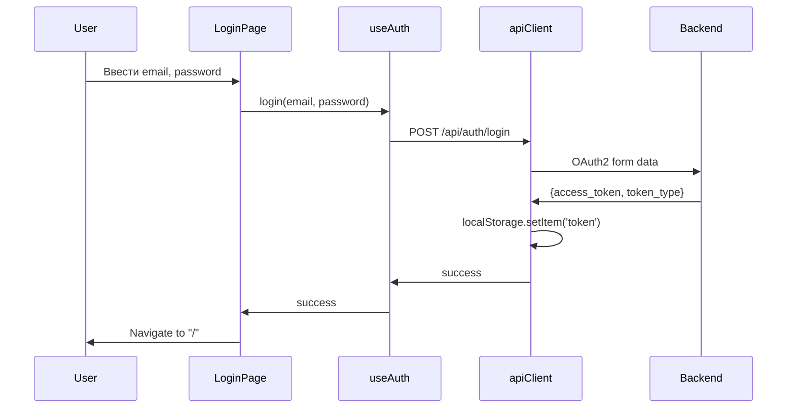
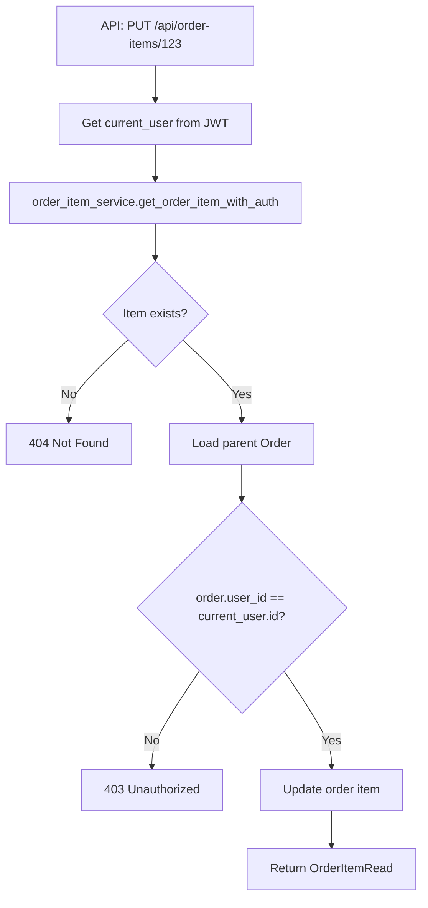

# ROADMAP: Спринт 2.0 — User-Facing Features

**Проект:** BM Smart Parcel Tracker  
**Длительность:** 3 недели (15-18 рабочих дней)  
**Фокус:** User-facing фичи и завершение базового функционала  
**Статус:** Готов к выполнению  
**Дата:** 14 февраля 2026

---

## Контекст и предпосылки

### Что уже готово (Iteration 1.0-1.1)

**Backend:**
- FastAPI + SQLAlchemy 2.0 (async)
- JWT аутентификация (bcrypt)
- CRUD сервисы: User, Order, Parcel (с authorization checks)
- Pydantic schemas для всех entity
- Alembic миграции (2 миграции выполнены)
- 19/19 pytest тестов проходят (100%)
- Ruff linting: 0 ошибок

**Frontend:**
- React 19 + Vite 7 + Tailwind 4
- TanStack Table с expandable rows
- API client с token management
- Hooks: useAuth, useOrders, useParcels, useCurrentUser
- DesktopDashboard с MasterTable (grouping parcel → order items)

**Infrastructure:**
- Docker Compose (dev + prod)
- GitHub Actions CI/CD (lint, test, build)
- Nginx config с SSL и rate limiting
- Logging (structured)

**Что НЕ готово (gaps):**
1. Auth UI (нет login/register страниц)
2. Filters и CSV export (plan есть, но не выполнен)
3. OrderItem API endpoints (нет dedicated routes)
4. User profile management (PUT /me, DELETE /me не exposed)
5. Protected routes на frontend (route guards)

---

## Цели спринта 2.0

**Primary Goal:**  
Сделать приложение полностью юзабельным для manual data entry и базовой работы с таблицей.

**Success Criteria:**
- Пользователь может зарегистрироваться и войти через UI
- Защищенные маршруты работают (редирект на login)
- Фильтры "Потеряшки", "Ожидают действий", "По тегам" активны
- Кнопка "Скачать CSV" генерирует плоский отчет
- Пользователь может редактировать свой профиль
- OrderItem можно создавать/редактировать через API (для будущих фич)

---

## Архитектурные принципы

### Clean Architecture Layers

```
┌─────────────────────────────────────┐
│   API Layer (routes, HTTP)          │  ← FastAPI routers
├─────────────────────────────────────┤
│   Schemas (Pydantic validation)     │  ← Request/Response DTOs
├─────────────────────────────────────┤
│   Service Layer (business logic)    │  ← CRUD + authorization
├─────────────────────────────────────┤
│   Models (SQLAlchemy ORM)           │  ← Database entities
├─────────────────────────────────────┤
│   Database (PostgreSQL)              │  ← Persistence
└─────────────────────────────────────┘
```

**Dependency Direction:** API → Service → Model (только вниз, никогда вверх)

### SOLID Guidelines

**Single Responsibility:**
- Каждый service занимается одной entity (user_service, order_service, etc.)
- API роутеры только маршрутизация + валидация
- Schemas только валидация данных

**Open/Closed:**
- Новые фильтры добавляются как новые функции, не меняя существующие
- CSV export можно расширить через strategy pattern (если потребуется JSON, Excel)

**Liskov Substitution:**
- Все schemas наследуют от BaseModel с одинаковым поведением
- Service layer использует одинаковые сигнатуры (get_by_id, create, update, delete)

**Interface Segregation:**
- Schemas разделены: Create/Read/Update/WithItems (клиенты используют только нужное)
- API endpoints не принудительно требуют все поля

**Dependency Inversion:**
- Service layer зависит от абстракций (AsyncSession), не от конкретных имплементаций
- API зависит от service interfaces, не от прямых DB calls

---

## Задачи спринта

### Неделя 1: Auth UI + Protected Routes

#### Task 1.1: Frontend Auth Pages (3 дня) ✅ COMPLETED

**Цель:** Создать login и register страницы.

**Статус:** ✅ Реализовано 14.02.2026

**Файлы:**
- `frontend/src/pages/Login.tsx` (новый) ✅
- `frontend/src/pages/Register.tsx` (новый) ✅
- `frontend/src/App.tsx` (обновить routes) ✅

**Требования:**
- Login форма: email, password, кнопка "Войти", ссылка "Зарегистрироваться"
- Register форма: email, password, main_currency (select), кнопка "Зарегистрироваться"
- Использовать `useAuth` hook (уже существует)
- При успешной аутентификации редирект на `/`
- Показывать ошибки (email занят, неверный пароль)
- Loading states

**Design:**
- Tailwind utility classes
- Центрированный layout с max-width card
- Dark mode support (prefers-color-scheme)

**Interface Contract (useAuth hook):**
```typescript
// frontend/src/hooks/useAuth.ts
const { 
  login,       // (email, password) => Promise<void>
  register,    // (email, password, main_currency) => Promise<void>
  logout,      // () => void
  isAuthenticated // boolean
} = useAuth();
```

**Test Strategy:**
- Manual: зарегистрировать пользователя, войти, проверить token в localStorage
- (Автотесты отложены на Iteration 2.3)

---

#### Task 1.2: Protected Routes (1 день)

**Цель:** Защитить DesktopDashboard, редиректить неавторизованных на /login.

**Файлы:**
- `frontend/src/components/ProtectedRoute.tsx` (новый)
- `frontend/src/App.tsx` (обновить)

**Требования:**
- Wrapper компонент `ProtectedRoute`
- Проверяет `apiClient.getToken()`
- Если нет токена → `<Navigate to="/login" />`
- Если токен есть → render children

**Example:**
```tsx
<Routes>
  <Route path="/login" element={<Login />} />
  <Route path="/register" element={<Register />} />
  <Route path="/" element={
    <ProtectedRoute>
      <DesktopDashboard />
    </ProtectedRoute>
  } />
</Routes>
```

**Test Strategy:**
- Очистить localStorage, перейти на `/` → редирект на `/login`
- Войти → должен показаться DesktopDashboard

---

#### Task 1.3: User Profile Management (2 дня)

**Backend:**

**Файлы:**
- `backend/app/api/users.py` (обновить)

**Новые endpoints:**
- `PUT /api/users/me` — обновить текущего пользователя (email, main_currency)
- `DELETE /api/users/me` — удалить аккаунт

**Service Layer (уже есть):**
- `user_service.update_user(db, user_id, update_data)` — уже реализован
- `user_service.delete_user(db, user_id)` — уже реализован

**Schemas (уже есть):**
- `UserUpdate` (email optional, main_currency optional)

**Authorization:**
- Пользователь может редактировать/удалять только себя (проверка `current_user.id == user_id`)

**Frontend:**

**Файлы:**
- `frontend/src/pages/Profile.tsx` (новый)
- `frontend/src/hooks/useUsers.ts` (обновить)
- `frontend/src/App.tsx` (добавить route `/profile`)

**Требования:**
- Форма редактирования: email, main_currency
- Кнопка "Сохранить"
- Кнопка "Удалить аккаунт" (с подтверждением)
- При удалении аккаунта → logout + редирект на `/register`

**Test Strategy:**
- Backend: добавить тесты `test_update_user_profile`, `test_delete_user_account` в `tests/test_users.py`
- Frontend: manual (автотесты отложены)

---

### Неделя 2: OrderItem API + Data Integrity

#### Task 2.1: OrderItem API Endpoints (2 дня)

**Цель:** Создать dedicated API для order items (для будущих фич: ручное добавление items, LLM import).

**Backend:**

**Файлы:**
- `backend/app/api/order_items.py` (новый)
- `backend/app/main.py` (зарегистрировать router)

**Endpoints:**
- `POST /api/order-items/` — создать item (требует order_id, может быть без parcel_id)
- `GET /api/order-items/{item_id}` — получить item
- `PUT /api/order-items/{item_id}` — обновить item (название, теги, статус, quantity_received, parcel_id)
- `DELETE /api/order-items/{item_id}` — удалить item

**Authorization:**
- Проверять, что item принадлежит order, который принадлежит current_user
- Логика в `order_item_service` (уже есть, но без auth checks)

**Service Layer Updates:**

**Файлы:**
- `backend/app/services/order_item_service.py` (обновить)

**Добавить:**
```python
async def get_order_item_with_auth(
    db: AsyncSession, 
    item_id: UUID, 
    user_id: UUID
) -> OrderItem:
    """Get order item and verify user owns the parent order."""
    item = await get_order_item_by_id(db, item_id)
    if not item:
        raise NotFoundException("Order item not found")
    
    # Load order to check ownership
    order = await get_order_by_id(db, item.order_id)
    if order.user_id != user_id:
        raise UnauthorizedException("Not your order item")
    
    return item
```

**Schemas (уже есть):**
- `OrderItemCreate`, `OrderItemRead`, `OrderItemUpdate`

**Test Strategy:**
- Новый файл `backend/tests/test_order_items.py`:
  - `test_create_order_item` (создать item для своего заказа)
  - `test_create_order_item_unauthorized` (попытка создать item для чужого заказа → 403)
  - `test_update_order_item` (обновить tags, quantity_received)
  - `test_delete_order_item`
  - `test_link_item_to_parcel` (установить parcel_id)

---

#### Task 2.2: Fix Order-Parcel Linkage (1 день)

**Проблема:**  
В `DesktopDashboard.tsx` сейчас order находится по `user_id`, а должен находиться через order items:

```typescript
// WRONG (current):
const order = orders.find(o => o.user_id === parcel.user_id);

// RIGHT (should be):
const order = orderItems.length > 0 
  ? orders.find(o => o.id === orderItems[0].order_id)
  : undefined;
```

**Файлы:**
- `frontend/src/pages/DesktopDashboard.tsx` (обновить)

**Требования:**
- Получать order items через новый endpoint (когда будет реализован) или включать их в `ParcelWithItems` schema
- Использовать `orderItems[0].order_id` для поиска order

**Backend (optional для этой задачи):**
- Можно добавить `GET /api/parcels/{id}?include_items=true` для eager loading order items
- Или использовать `ParcelWithItems` schema (уже есть, но не используется в API)

---

### Неделя 3: Filters + CSV Export

#### Task 3.1: Implement Filters (3 дня)

**Базируется на:** `.cursor/plans/filters_and_csv_export_c72423c0.plan.md`

**Файлы:**
- `frontend/src/pages/DesktopDashboard.tsx` (обновить)

**Фильтры:**

**1. "Потеряшки"** (Lost parcels)
- Посылки со статусом `In_Transit` или `Created`
- И `tracking_updated_at` старше 30 дней (или null)

**2. "Ожидают действий"** (Action required)
- Order с `protection_end_date` через < 5 дней от сегодня
- ИЛИ есть order items с `quantity_received < quantity_ordered`

**3. "По тегам"** (By tags)
- Показывать только parcels, у которых хотя бы один order item содержит выбранный tag
- UI: dropdown с уникальными тегами из всех order items

**State Management:**
```typescript
const [filters, setFilters] = useState({
  lostParcels: false,
  actionRequired: false,
  selectedTag: null as string | null
});
```

**UI:**
- Кликабельные chips: "Потеряшки", "Ожидают действий"
- Dropdown для тегов (или chip для каждого уникального тега)
- Active state (другой цвет border/background)

**Filter Function:**
```typescript
function filterRows(rows: ParcelRow[], filters: Filters): ParcelRow[] {
  return rows.filter(row => {
    // Lost parcels filter
    if (filters.lostParcels) {
      const isLost = 
        (row.parcel.status === 'In_Transit' || row.parcel.status === 'Created') &&
        (!row.parcel.tracking_updated_at || 
         daysSince(row.parcel.tracking_updated_at) > 30);
      if (!isLost) return false;
    }
    
    // Action required filter
    if (filters.actionRequired) {
      const needsAction = 
        (row.order?.protection_end_date && 
         daysUntil(row.order.protection_end_date) < 5) ||
        row.orderItems.some(item => 
          item.quantity_received < item.quantity_ordered
        );
      if (!needsAction) return false;
    }
    
    // Tag filter
    if (filters.selectedTag) {
      const hasTag = row.orderItems.some(item => 
        item.tags.includes(filters.selectedTag)
      );
      if (!hasTag) return false;
    }
    
    return true;
  });
}
```

**Test Data:**
- Расширить mock данные в DesktopDashboard:
  - Добавить вторую посылку со старой `tracking_updated_at`
  - Добавить заказ с `protection_end_date` через 3 дня
  - Добавить items с разными тегами (#gift, #electronics, #clothing)

**Test Strategy:**
- Manual: включить каждый фильтр, проверить что таблица фильтруется корректно

---

#### Task 3.2: CSV Export (2 дня)

**Базируется на:** System Design §3.4 (Export spec)

**Файлы:**
- `frontend/src/utils/exportCsv.ts` (новый)
- `frontend/src/components/MasterTable.tsx` (обновить)

**Формат CSV:**
- Плоский отчет: одна строка = один order item
- Колонки:
  - `Date` — order.order_date (ISO format или DD.MM.YYYY)
  - `Order ID` — order.order_number_external
  - `Item Name` — item_name
  - `Tags` — tags.join(', ')
  - `Price (Original)` — price_original + currency_original
  - `Price (Base)` — price_final_base + " RUB" (или main_currency)
  - `Tracking` — parcel.tracking_number
  - `Status` — item_status

**Implementation:**
```typescript
// frontend/src/utils/exportCsv.ts

export function buildFlatCsv(rows: ParcelRow[]): string {
  const headers = [
    'Date', 'Order ID', 'Item Name', 'Tags', 
    'Price (Original)', 'Price (Base)', 'Tracking', 'Status'
  ];
  
  const csvRows = [headers.join(',')];
  
  rows.forEach(row => {
    row.orderItems.forEach(item => {
      const order = row.order;
      const csvRow = [
        order?.order_date || '',
        order?.order_number_external || '',
        escapeCsv(item.item_name),
        escapeCsv(item.tags.join(', ')),
        order ? `${order.price_original} ${order.currency_original}` : '',
        order ? `${order.price_final_base} RUB` : '',
        row.parcel.tracking_number,
        item.item_status
      ];
      csvRows.push(csvRow.join(','));
    });
  });
  
  return csvRows.join('\n');
}

function escapeCsv(str: string): string {
  if (str.includes(',') || str.includes('"') || str.includes('\n')) {
    return `"${str.replace(/"/g, '""')}"`;
  }
  return str;
}

export function downloadCsv(content: string, filename: string) {
  const blob = new Blob([content], { type: 'text/csv;charset=utf-8;' });
  const link = document.createElement('a');
  link.href = URL.createObjectURL(blob);
  link.download = filename;
  link.click();
  URL.revokeObjectURL(link.href);
}
```

**MasterTable Update:**
```tsx
// frontend/src/components/MasterTable.tsx

import { buildFlatCsv, downloadCsv } from '../utils/exportCsv';

function MasterTable({ rows }: { rows: ParcelRow[] }) {
  const handleExportCsv = () => {
    const csv = buildFlatCsv(rows); // Use filtered rows
    const filename = `parcels-export-${new Date().toISOString().split('T')[0]}.csv`;
    downloadCsv(csv, filename);
  };
  
  return (
    <div>
      {/* ... */}
      <button onClick={handleExportCsv} aria-label="Скачать CSV">
        Скачать CSV
      </button>
      {/* ... */}
    </div>
  );
}
```

**Test Strategy:**
- Скачать CSV с mock данными
- Открыть в Excel/Google Sheets
- Проверить: кириллица корректна (UTF-8), запятые в названиях escaped, строк столько же сколько items

---

## Definition of Done

### Task 1: Auth UI
- [x] Login страница работает (вход с существующим пользователем) ✅
- [x] Register страница работает (создание нового пользователя) ✅
- [x] При успешном входе редирект на `/` ✅
- [x] При неуспешном входе показывается ошибка ✅
- [ ] Protected route редиректит на `/login` если не авторизован (Task 1.2)
- [ ] Logout работает (очистка token, редирект на login) - функция реализована в useAuth, UI кнопка pending

### Task 2: User Profile
- [ ] `PUT /api/users/me` обновляет email и main_currency
- [ ] `DELETE /api/users/me` удаляет аккаунт
- [ ] Frontend страница `/profile` позволяет редактировать профиль
- [ ] Backend тесты для update/delete проходят
- [ ] Authorization: нельзя изменить чужой профиль

### Task 3: OrderItem API
- [ ] `POST /api/order-items/` создает item
- [ ] `PUT /api/order-items/{id}` обновляет item
- [ ] `DELETE /api/order-items/{id}` удаляет item
- [ ] Authorization: нельзя редактировать чужие items
- [ ] Backend тесты проходят (5+ тестов)

### Task 4: Order-Parcel Linkage
- [ ] DesktopDashboard использует order_id из orderItems, а не user_id
- [ ] Order items загружаются вместе с parcels (или через отдельный endpoint)

### Task 5: Filters
- [ ] Фильтр "Потеряшки" работает
- [ ] Фильтр "Ожидают действий" работает
- [ ] Фильтр "По тегам" работает
- [ ] Можно включить несколько фильтров одновременно
- [ ] UI показывает активные фильтры

### Task 6: CSV Export
- [ ] Кнопка "Скачать CSV" генерирует файл
- [ ] CSV содержит все видимые строки (с учетом фильтров)
- [ ] Формат соответствует спецификации (8 колонок)
- [ ] Кириллица корректна (UTF-8)
- [ ] Запятые и кавычки escaped

---

## Риски и зависимости

### Риски

**1. OrderItem API блокирует Order-Parcel linkage**
- **Вероятность:** Средняя
- **Митигация:** Можно временно использовать mock order items в frontend или eager load через `ParcelWithItems` schema

**2. CSV с большим объемом данных (>1000 строк) может тормозить браузер**
- **Вероятность:** Низкая (на MVP не будет столько данных)
- **Митигация:** Async CSV generation отложен на Iteration 2.2 (backend endpoint)

**3. Filters могут быть медленными при большом массиве**
- **Вероятность:** Низкая
- **Митигация:** useMemo для filterRows; если станет проблемой — backend filtering

### Зависимости

- **Task 1.2 зависит от Task 1.1** (сначала нужны login/register страницы)
- **Task 2.2 зависит от Task 2.1** (нужны order items в API)
- **Task 3.2 зависит от Task 3.1** (CSV должен экспортировать отфильтрованные данные)

---

## Метрики успеха

**Количественные:**
- Frontend build time < 1s
- Frontend bundle size < 350 KB (gzipped)
- Backend test coverage: ≥ 25 тестов (было 19, добавим 6+ для order items и users)
- Все CI/CD checks проходят (lint, type check, tests, build)

**Качественные:**
- Приложение юзабельно без mock данных (можно зарегистрироваться, войти, добавить данные вручную)
- Фильтры и CSV работают интуитивно
- Код следует Clean Architecture (нет API → Model прямых вызовов)

---

## После спринта 2.0

**Что будет готово:**
- ✅ Полностью рабочий auth flow
- ✅ Базовая работа с таблицей (фильтры, экспорт)
- ✅ OrderItem API для будущих фич
- ✅ User profile management

**Что НЕ будет готово (следующие спринты):**
- LLM Vision import (отложен на Iteration 2.2+)
- Currency module (CBR API, rate freezing)
- Tracking queue (Redis + Celery)
- Mobile PWA features
- Frontend тесты (отложены на Iteration 2.3)

**Следующий фокус (Спринт 2.1):**  
См. `ROADMAP_next-planned.md`

---

## Приложение: Mermaid Диаграммы

### Auth Flow



### OrderItem Authorization



### Filter Flow

```mermaid
flowchart LR
    subgraph DesktopDashboard
        A[Raw ParcelRow[]] --> B[filterRows]
        C[Filter State] --> B
        B --> D[Filtered ParcelRow[]]
        D --> E[MasterTable]
    end
    
    subgraph Filters
        F[Потеряшки] --> C
        G[Ожидают действий] --> C
        H[По тегам] --> C
    end
```

---

**Документ подготовлен:** 14 февраля 2026  
**Автор:** AI Assistant (Claude Sonnet 4.5)  
**Версия:** 1.0  
**Статус:** Ready for Sprint Planning
