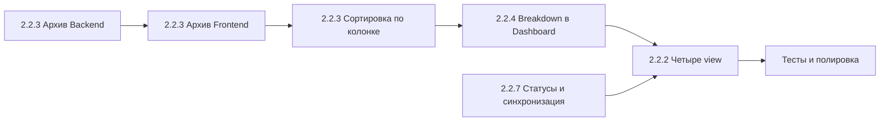

# Детальный план спринта 2.2 — Advanced Features & UX

**Проект:** BM Smart Parcel Tracker  
**Спринт:** 2.2  
**Длительность:** 3–4 недели (15–20 рабочих дней)  
**Статус:** В работе (частично выполнен)  
**Дата плана:** 15 февраля 2026

---

## Текущее состояние (после аудита)

### Уже сделано (не дублировать)

| Блок | Реализация |
|------|------------|
| **2.2.1 Split Shipments** | Backend: модель `ParcelItem`, миграция 004, сервис, API под `/api/parcels/{id}/items`. Frontend: `useParcelItems`, ParcelForm — выбор товаров и количество в посылке; в Dashboard отображаются `in_parcels` и распределение по посылкам. |
| **2.2.4 Формула стоимости** | Backend: `shipping_cost`, `customs_cost`, `total_order_cost`, миграция 005, `recalculate_order_totals`. Frontend: OrderForm — поля «Доставка», «Пошлина», итого (товары + доставка + пошлина). |
| **Удаление** | Удаление заказа по варианту C (`deleted_at`), миграция 006; удаление посылки; подтверждение в UI, refetch после удаления. |
| **Сортировка** | В Dashboard: dropdown выбора поля сортировки + кнопка направления (↑/↓), клик по заголовку колонки с индикатором ▲/▼, сортировка на клиенте по `orderRows` и `orphanParcels`. |
| **2.2.3 Архивирование** | Миграция 012, поле `is_archived` в Order и Parcel; API `include_archived`, PUT с `is_archived`; Frontend: переключатель «Показать архив», кнопка «В архив», тесты. |
| **2.2.4 Breakdown в Dashboard** | В развёрнутой карточке заказа отображается разбивка: товары / доставка / пошлина / итого. |
| **2.2.2 Три вида Dashboard** | Переключатель [Заказы] [Посылки] [Товары]; вид «По посылкам» с вложенными товарами; вид «По товарам» — плоский список с группировками. |

### Не сделано (объём спринта)

1. **2.2.2 Вид «По статусу»** — отдельный таб с группировкой по статусу доставки (Kanban-подобно).
2. **2.2.7 Статусы заказа/позиций и синхронизация с посылками** — полный набор статусов позиции заказа (в т.ч. «Потеряно»), отображение в UI, автообновление статусов позиций при изменении статуса посылки.

---

## Порядок выполнения (рекомендуемый)

**Неделя 1:** Задача 2.2.3 (архивирование) — backend + frontend; при возможности — начало 2.2.7 (enum + миграция Lost).  
**Неделя 2:** Сортировка по заголовку + breakdown стоимости в Dashboard; завершение 2.2.7 (логика синхронизации при смене статуса посылки, UI статусов).  
**Неделя 3–4:** Четыре вида Dashboard + тесты и полировка.

---

## Задача 2.2.3: Архивирование (is_archived)

### Цель

Мягкое архивирование заказов и посылок без удаления: по умолчанию скрыты, по переключателю «Показать архив» — видны; кнопка «В архив» в строке.

### 2.2.3.1 Backend

**Шаг 1. Миграция**

- **Файл:** `backend/alembic/versions/012_add_is_archived_to_orders_and_parcels.py` (новый).
- **Содержимое:**
  - `upgrade`: добавить в `orders` колонку `is_archived BOOLEAN NOT NULL DEFAULT FALSE`; добавить в `parcels` колонку `is_archived BOOLEAN NOT NULL DEFAULT FALSE`.
  - `downgrade`: удалить эти колонки.
- **Проверка:** `alembic upgrade head` без ошибок; откат `alembic downgrade -1` и снова `upgrade head`.

**Шаг 2. Модели**

- **Файл:** `backend/app/models/order.py`
  - Добавить: `is_archived: Mapped[bool] = mapped_column(Boolean, default=False, nullable=False)` (после `deleted_at` или в логическом блоке).
- **Файл:** `backend/app/models/parcel.py`
  - Добавить: `is_archived: Mapped[bool] = mapped_column(Boolean, default=False, nullable=False)`.

**Шаг 3. Схемы**

- **Файл:** `backend/app/schemas/order.py`
  - В `OrderBase` или `OrderRead`: `is_archived: bool = False`.
  - В `OrderUpdate`: `is_archived: bool | None = None`.
- **Файл:** `backend/app/schemas/parcel.py`
  - В `ParcelRead` (и базовый класс): `is_archived: bool = False`.
  - В `ParcelUpdate`: `is_archived: bool | None = None`.

**Шаг 4. Сервисы — фильтр и обновление**

- **Файл:** `backend/app/services/order_service.py`
  - В `get_user_orders` добавить параметр `include_archived: bool = False`. Если `False`, добавлять к query: `query.where(Order.is_archived.is_(False))`. Уже есть фильтр по `deleted_at` — оставить оба.
  - В `update_order`: при передаче `is_archived` в данных — обновлять поле у `order`.
- **Файл:** `backend/app/services/parcel_service.py`
  - В `get_user_parcels` (или аналог списка) добавить параметр `include_archived: bool = False` и фильтр по `Parcel.is_archived`.
  - В `update_parcel`: поддерживать обновление `is_archived`.

**Шаг 5. API — query-параметр и PATCH**

- **Файл:** `backend/app/api/orders.py`
  - В `list_orders`: добавить `include_archived: bool = Query(False, description="Include archived orders")`, передавать в `order_service.get_user_orders(..., include_archived=include_archived)`.
  - Архив через существующий PUT: в теле передавать `{"is_archived": true}`. Отдельный endpoint не обязателен.
- **Файл:** `backend/app/api/parcels.py`
  - В `list_parcels`: добавить `include_archived: bool = Query(False)`, передавать в сервис.
  - Архив через PUT `ParcelUpdate` с `is_archived: true`.

**DoD Backend 2.2.3:**

- [x] Миграция 012 применена, в БД есть колонки в `orders` и `parcels`.
- [x] GET `/api/orders/` и GET `/api/parcels/` по умолчанию не возвращают архивированные.
- [x] С параметром `?include_archived=true` архивированные возвращаются.
- [x] PUT `/api/orders/{id}` и PUT `/api/parcels/{id}` с `{"is_archived": true}` переводят в архив.
- [x] В ответах Read присутствует поле `is_archived`.

---

### 2.2.3.2 Frontend

**Шаг 1. Типы**

- **Файл:** `frontend/src/types/index.ts`
  - В интерфейс `Order` добавить: `is_archived?: boolean`.
  - В интерфейс `Parcel` добавить: `is_archived?: boolean`.

**Шаг 2. Хуки — передача include_archived и archive**

- **Файл:** `frontend/src/hooks/useOrders.ts`
  - Добавить параметр `includeArchived?: boolean` (например в опции или второй аргумент). В `fetchOrders` формировать URL: `?include_items=true&include_archived=${includeArchived ?? false}`.
  - Добавить функцию `archiveOrder(id: string)`: вызвать `apiClient.put(\`/orders/${id}\`, { is_archived: true })`, затем обновить локальный state (убрать из списка или пометить) и/или вызвать refetch.
  - Вернуть из хука: `archiveOrder`, при необходимости `includeArchived` и способ его переключения (или управление на уровне страницы).
- **Файл:** `frontend/src/hooks/useParcels.ts`
  - Аналогично: параметр для `include_archived` в запросе списка; функция `archiveParcel(id: string)` (PUT с `is_archived: true`).
  - Вернуть: `archiveParcel`, поддержка запроса с `include_archived`.

**Шаг 3. DesktopDashboard — state и UI**

- **Файл:** `frontend/src/pages/DesktopDashboard.tsx`
  - State: `const [showArchived, setShowArchived] = useState(false)`.
  - При вызове `useOrders(true)` и `useParcels()` передавать флаг `include_archived: showArchived` (или эквивалент в текущей сигнатуре хуков).
  - В блоке фильтров: чекбокс или переключатель «Показать архив» (`showArchived`), при изменении — refetch с новым флагом.
  - В строке заказа: рядом с кнопкой «Удалить» добавить кнопку «В архив» (показывать только если `!row.order.is_archived`). По клику — вызов `archiveOrder(row.order.id)`, затем refetch.
  - В блоке «Посылки без заказа» (или в списке посылок): кнопка «В архив» для посылки, вызов `archiveParcel(parcel.id)`.
  - Для архивированных строк можно визуально отличать (например приглушённый стиль или бейдж «В архиве»).

**DoD Frontend 2.2.3:**

- [x] По умолчанию архивированные заказы и посылки не показываются.
- [x] Переключатель «Показать архив» есть; при включении список перезапрашивается и показываются архивированные.
- [x] Кнопка «В архив» у заказа и посылки; по нажатию запись архивируется и список обновляется.
- [x] В типах и ответах API используется поле `is_archived`.

---

## Задача 2.2.3 (продолжение): Сортировка по клику на заголовок колонки

### Цель

Сделать заголовки таблицы/списка кликабельными: клик задаёт поле сортировки и переключает направление (asc/desc), визуальный индикатор ▲/▼.

### Реализация

Текущая разметка Dashboard: не таблица с `<thead>`, а список карточек заказов с блоком фильтров (dropdown «Сортировка» + кнопка направления). Варианты:

**Вариант A (минимальный):** Оставить один общий dropdown сортировки, но добавить в шапку блока «Заказы и посылки» небольшую панель: иконки-кнопки по полям (Дата, Магазин, Сумма, Защита и т.д.), каждая ведёт себя как переключатель «сортировать по этому полю» с индикатором направления. При клике по уже выбранному полю — менять направление.

**Вариант B (таблица):** Перестроить список заказов в таблицу с фиксированными колонками (Дата, Заказ, Сумма, Товары, Посылки, Защита, Действия). Заголовки колонок — кнопки; клик задаёт `sortBy` и по повторному клику — `sortDir`. Строка по клику разворачивается (как сейчас).

Рекомендация: **Вариант A** для быстрого DoD без большой переделки вёрстки.

**Шаги (Вариант A):**

- **Файл:** `frontend/src/pages/DesktopDashboard.tsx`
  - Рядом с текущим dropdown сортировки добавить группу кнопок: «Дата», «Магазин», «Сумма», «Защита», «Статус» и т.д. Каждая кнопка при клике: установить `setSortBy(...)` и при повторном клике по тому же полю — `setSortDir(d => d === 'asc' ? 'desc' : 'asc')`.
  - Активное поле подсвечивать; рядом с активным показывать ▲ или ▼ в зависимости от `sortDir`.
  - Либо: заменить dropdown на такую группу кнопок полностью (тогда один источник правды для sortBy/sortDir).

**DoD:**

- [ ] Пользователь может выбрать поле сортировки кликом по кнопке/заголовку.
- [ ] Визуально видно текущее поле и направление (▲/▼).
- [ ] Повторный клик по тому же полю меняет направление.

---

## Задача 2.2.4 (часть 2): Breakdown стоимости в Dashboard

### Цель

В развёрнутой карточке заказа показывать разбивку: сумма по товарам, доставка, пошлина, итого.

### Реализация

- **Файл:** `frontend/src/pages/DesktopDashboard.tsx`
  - В блоке `isExpanded && (...)` для каждого заказа, после списка товаров (или перед ним), вывести блок «Стоимость»:
    - Товары: сумма `itemsTotal = Σ (price_per_item × quantity_ordered)` по `row.items`.
    - Доставка: `row.order.shipping_cost ?? 0`.
    - Пошлина: `row.order.customs_cost ?? 0`.
    - Итого: можно использовать `row.order.price_original` (уже в валюте заказа) или пересчитать как itemsTotal + shipping + customs для консистентности.
  - Отображать в одной валюте заказа (и при необходимости «≈ X ₽» из price_final_base, если есть в ответе).
  - Формат: например «Товары: 1000 ₽ · Доставка: 500 ₽ · Пошлина: 200 ₽ → Итого: 1700 ₽».

**DoD:**

- [x] В развёрнутой карточке заказа видна разбивка: товары / доставка / пошлина / итого.
- [x] Числа соответствуют данным заказа (и при необходимости order_items).

---

## Задача 2.2.2: Четыре вида Dashboard

### Цель

Четыре режима отображения: по заказам (текущий), по посылкам, по товарам (плоский список), по статусу (группировка по статусу доставки).

### 2.2.2.1 State и переключатель

- **Файл:** `frontend/src/pages/DesktopDashboard.tsx`
  - Тип: `type ViewMode = 'orders' | 'parcels' | 'items' | 'status'`.
  - State: `const [viewMode, setViewMode] = useState<ViewMode>('orders')`.
  - Под блоком заголовка «Главная»: табы или кнопки `[Заказы] [Посылки] [Товары] [Статус]`. Активный подсвечивать. По клику — `setViewMode(...)`.

### 2.2.2.2 Данные для каждого вида

Исходные данные уже есть: `orderRows` (order-centric), `parcels`, `orders`. Вычислить:

- **ordersView:** текущий `sortedOrderRows` (уже есть).
- **parcelsView:** массив «посылка + привязанные заказы/товары». Построить из `parcels`: для каждой посылки собрать items из `orderRows` (где в item.in_parcels есть эта посылка) или из API (если есть ответ с items по посылке). Структура: `{ parcel, items: OrderItem[], orders: Order[] }[]`.
- **itemsView:** плоский список всех order_items с привязкой к заказу и посылкам. Построить из `orderRows`: `orderRows.flatMap(row => row.items.map(item => ({ item, order: row.order, parcels: row.parcels })))`. Отфильтровать дубликаты по item.id.
- **statusGroups:** сгруппировать по статусу доставки. Ключ — статус посылки или агрегированный статус заказа (например «В пути», «Получено»). Значение — список заказов или посылок. Можно строить из `orderRows` и `parcels`: группировка по `ParcelStatus` или по производному статусу заказа.

Реализовать в `useMemo`, зависящих от `orderRows`, `parcels`, `viewMode` (и фильтров), чтобы не пересчитывать лишнее.

### 2.2.2.3 Рендер по viewMode

- **viewMode === 'orders':** текущая разметка — список заказов с раскрытием (items + parcels). Без изменений.
- **viewMode === 'parcels':** список карточек «Посылка»: трек, перевозчик, статус, вес; при раскрытии — список товаров в этой посылке (и откуда заказы). Можно переиспользовать структуру карточек, но данные из `parcelsView`.
- **viewMode === 'items':** таблица или список строк: колонки «Товар», «Заказ», «Кол-во», «В посылках», «Статус». Данные из `itemsView`.
- **viewMode === 'status':** группы (например «В пути», «Получено», «Ожидают»). В каждой группе — список заказов или посылок. Рендер: заголовок группы, затем карточки.

**Файлы:**

- Вся логика в `frontend/src/pages/DesktopDashboard.tsx` допустима; при росте объёма вынести преобразования в `frontend/src/pages/dashboardViews.ts` (или `utils/dashboardViews.ts`): функции `buildParcelsView(...)`, `buildItemsView(...)`, `buildStatusGroups(...)`.

**DoD 2.2.2:**

- [x] Переключатель видов виден и переключает режим (Заказы, Посылки, Товары).
- [x] Вид «По заказам» совпадает с текущим поведением.
- [x] Вид «По посылкам» показывает посылки с вложенными товарами.
- [x] Вид «По товарам» показывает плоский список товаров с заказом и посылками.
- [ ] Вид «По статусу» (отдельный таб) — группирует по статусу доставки (в планах).

---

## Задача 2.2.7: Статусы заказа/позиций и синхронизация с посылками

### Цель

Единый набор статусов для позиций заказа (order_item) с отображением в UI и **автообновлением при изменении статуса посылки**: посылка «Доставлена» или «Потеряна» → статусы связанных позиций заказа пересчитываются.

### Список статусов (позиция заказа)

| Код (enum) | Отображение (RU) | Когда используется |
|------------|------------------|---------------------|
| Waiting_Payment | Ждёт оплаты | Ожидание оплаты |
| Payment_Verification | Проверка оплаты | Платёж проверяется |
| Seller_Packing | В сборке | Продавец собирает заказ |
| Partially_Shipped | Частично отправлено | Split: часть в посылках в пути |
| Shipped | Отправлено | Вся позиция отправлена |
| Partially_Received | Частично получено | Split: часть посылок получена |
| Received | Получено | Вся позиция получена |
| Lost | Потеряно | Посылка со статусом «Потеряна» |
| Cancelled | Заказ отменён | Позиция отменена |

Дополнительно в enum уже есть: Dispute_Open, Refunded, Waiting_Shipment (маппинг на «В сборке» в UI). В списке выше — минимальный набор для отображения «статусов заказа» и синхронизации с посылками.

### 2.2.7.1 Backend

**Шаг 1. Enum и миграция**

- **Файл:** `backend/app/models/enums.py`
  - Добавить в `OrderItemStatus`: `Lost = "Lost"`.
- **Файл:** `backend/alembic/versions/013_add_order_item_status_lost.py` (новый).
  - `upgrade`: добавить значение `'Lost'` в enum `orderitemstatus` (PostgreSQL: `ALTER TYPE orderitemstatus ADD VALUE IF NOT EXISTS 'Lost'` или через Alembic op.execute).
  - `downgrade`: в PostgreSQL enum values обычно не удаляют; при необходимости документировать ограничение или оставить пустой downgrade.

**Шаг 2. Синхронизация: при смене статуса посылки обновлять позиции заказа**

- **Файл:** `backend/app/services/parcel_service.py` (или новый `backend/app/services/order_item_status_sync.py`).
  - После обновления посылки (`update_parcel`) проверять, изменился ли `status`.
  - Если новый статус **Delivered**: для всех записей `parcel_items` этой посылки — взять `order_item_id` и `quantity`; для каждого такого `OrderItem` увеличить `quantity_received` на `quantity` из ParcelItem; затем пересчитать `item_status` позиции: если `quantity_received >= quantity_ordered` → `Received`, иначе → `Partially_Received`.
  - Если новый статус **Lost**: для всех `order_item_id` из `parcel_items` этой посылки установить `item_status = OrderItemStatus.Lost`.
  - Если статус посылки сменился с Delivered/Lost на что-то другое (например In_Transit) — по желанию откатывать quantity_received и статус (сложнее и реже нужно); в первой итерации можно только «прогрессировать» (Delivered/Lost → обновляем позиции).
- Вызов этой логики: из `parcel_service.update_parcel` после `db.commit()` и `db.refresh(parcel)` — вызвать функцию синхронизации (получить parcel_items по parcel_id, затем обновить затронутые order_items). Либо вынести в отдельную функцию `sync_order_item_statuses_on_parcel_status_change(db, parcel_id, new_status)` и вызывать её из API/сервиса после update.

**Шаг 3. Пересчёт item_status по всем посылкам позиции (split)**

- Для одной позиции заказа (order_item) товар может быть в нескольких посылках. При смене статуса **одной** посылки нужно обновить только ту часть, которая относится к этой посылке: для Delivered — добавить к `quantity_received` количество из данной посылки; итоговый `item_status`: если суммарно `quantity_received >= quantity_ordered` → Received, иначе Partially_Received. Для Lost — пометить позицию Lost только если это единственная посылка с этой позицией или принять правило «хотя бы одна посылка потеряна → позиция Partially_Received / Lost» (например: если все посылки с этой позицией Lost → Lost; иначе оставить Partially_Received/Received по уже доставленным). Уточнение в реализации: при Lost можно выставлять статус позиции в Lost только для количества из этой посылки не получать — тогда оставляем Partially_Received и quantity_received без изменений для потерянной части.

Упрощённое правило для первой версии:
- **Delivered:** по всем ParcelItem этой посылки: order_item.quantity_received += parcel_item.quantity; затем для каждого затронутого order_item: если quantity_received >= quantity_ordered → item_status = Received, иначе item_status = Partially_Received.
- **Lost:** по всем order_item из parcel_items этой посылки: item_status = Lost (вся позиция или её часть считается потерянной; при split можно позже уточнить, что Lost только если вся позиция в потерянных посылках).

**Шаг 4. API**

- Обновление статуса позиции вручную: уже есть PUT `/api/order-items/{id}` с полем `item_status`. Достаточно убедиться, что в схемах и валидации допускается значение `Lost`.
- Отдельный endpoint для «обновить статусы позиций по посылке» не обязателен — синхронизация выполняется при PUT посылки (смене статуса).

**DoD Backend 2.2.7:**

- [ ] В enum OrderItemStatus есть значение Lost; миграция применена.
- [ ] При обновлении посылки на статус Delivered: связанные через parcel_items order_items получают обновлённые quantity_received и item_status (Received / Partially_Received).
- [ ] При обновлении посылки на статус Lost: связанные order_items переходят в статус Lost.
- [ ] Ручное изменение item_status через PUT order-item по-прежнему возможно (в т.ч. Lost, Cancelled и др.).

### 2.2.7.2 Frontend

**Шаг 1. Типы и подписи**

- **Файл:** `frontend/src/types/index.ts`
  - В тип `OrderItemStatus` добавить: `'Lost'`.
  - В `ORDER_ITEM_STATUS_LABELS` добавить: `Lost: 'Потеряно'`.
  - При необходимости: «В сборке» = Seller_Packing (уже есть «Сборка продавцом» — можно заменить на «В сборке»), «Заказ отменён» = Cancelled (уже «Отменено» — можно оставить или заменить).

**Шаг 2. Отображение в Dashboard**

- **Файл:** `frontend/src/pages/DesktopDashboard.tsx`
  - В развёрнутой карточке заказа для каждой позиции уже выводится `item_status`. Убедиться, что для статуса Lost отображается «Потеряно» (через ORDER_ITEM_STATUS_LABELS или явную проверку).
  - В виде «По статусу» можно группировать в т.ч. по item_status (Ждёт оплаты, В сборке, Отправлено, Получено, Потеряно, Отменено и т.д.).

**Шаг 3. Редактирование статуса в форме заказа**

- **Файл:** `frontend/src/pages/OrderForm.tsx` (или компонент редактирования позиции)
  - При редактировании позиции заказа — выбор статуса из списка (select): все значения из ORDER_ITEM_STATUS_LABELS, включая Lost. При отсутствии посылок можно ограничить список ранними и финальными статусами (по плану order_parcel_cost_stores) — опционально в первой итерации.

**DoD Frontend 2.2.7:**

- [ ] В списке статусов есть «Потеряно» (Lost) и «Заказ отменён» (Cancelled); подписи единообразны (Ждёт оплаты, Проверка оплаты, В сборке, Частично отправлено, Отправлено, Частично получено, Получено, Потеряно, Заказ отменён).
- [ ] В карточке заказа и в видах Dashboard статус позиции отображается корректно, в т.ч. после автообновления из-за смены статуса посылки.
- [ ] Пользователь может вручную выставить статус позиции (в т.ч. В сборке, Отправлено, Получено, Потеряно, Заказ отменён).

### Связь «посылка → статус заказа/позиций»

- Статус **заказа** в UI можно показывать как сводный по позициям: например «Получено», если все позиции в статусе Received; «В пути», если есть Shipped/Partially_Shipped; «Потеряно», если есть Lost; «Отменён», если все Cancelled. Реализация — вычисление на фронте по `order_items[].item_status` или опционально поле в API (computed при чтении). В рамках 2.2.7 достаточно автообновления **позиций** и отображения их статусов; сводный статус заказа — опционально (можно добавить в том же спринте или позже).

---

## Тесты и полировка

### Backend

- **Файл:** `backend/tests/test_orders.py`
  - Тест: создание заказа с `is_archived=False`; list без `include_archived` — не возвращает архивированные; с `include_archived=true` — возвращает.
  - Тест: PATCH (PUT) заказа с `is_archived=true`, затем list без include_archived — заказа нет в списке; с include_archived — есть и флаг true.
- **Файл:** `backend/tests/test_parcels.py`
  - Аналогично для посылок: list с/без include_archived, обновление is_archived.
- **Задача 2.2.7:** тесты синхронизации статусов: создать заказ с позицией и посылкой (parcel_item); обновить посылку на Delivered — проверить, что у order_item обновились quantity_received и item_status (Received/Partially_Received); обновить посылку на Lost — проверить item_status = Lost.
- Целевой объём: не менее 35 тестов в backend (уже есть тесты parcel_items, orders, parcels; добавить 2–4 на архив, 2–3 на синхронизацию статусов).

### Frontend

- Ручная проверка: архив (переключатель, кнопка «В архив»), сортировка по кнопкам, breakdown в карточке заказа, все 4 вида Dashboard; статусы позиций (в т.ч. Потеряно, Заказ отменён), смена статуса посылки и отображение обновлённого статуса позиции.
- ESLint и tsc без ошибок.

### CI

- Убедиться, что новые тесты входят в `pytest` в GitHub Actions; при необходимости обновить `backend/tests/conftest.py` под новые поля.

---

## Сводка по файлам (только изменения)

### Backend (новые)

- `backend/alembic/versions/012_add_is_archived_to_orders_and_parcels.py`
- `backend/alembic/versions/013_add_order_item_status_lost.py`

### Backend (изменяемые)

- `backend/app/models/order.py` — поле `is_archived`
- `backend/app/models/parcel.py` — поле `is_archived`
- `backend/app/models/enums.py` — значение `OrderItemStatus.Lost`
- `backend/app/schemas/order.py` — поле в Read/Update
- `backend/app/schemas/parcel.py` — поле в Read/Update
- `backend/app/services/order_service.py` — параметр `include_archived`, фильтр, обновление is_archived в update
- `backend/app/services/parcel_service.py` — параметр `include_archived`, фильтр, обновление в update; при смене status посылки — вызов синхронизации статусов позиций (Delivered → Received/Partially_Received, Lost → Lost)
- `backend/app/api/orders.py` — query `include_archived`
- `backend/app/api/parcels.py` — query `include_archived`
- `backend/tests/test_orders.py` — тесты на архив
- `backend/tests/test_parcels.py` — тесты на архив; при необходимости тесты синхронизации статусов в отдельном файле (например test_order_item_status_sync.py)

### Frontend (изменяемые)

- `frontend/src/types/index.ts` — `is_archived` в Order и Parcel; `OrderItemStatus` + `'Lost'`, `ORDER_ITEM_STATUS_LABELS` (в т.ч. «Потеряно», при необходимости «В сборке» / «Заказ отменён»)
- `frontend/src/hooks/useOrders.ts` — include_archived, archiveOrder
- `frontend/src/hooks/useParcels.ts` — include_archived, archiveParcel
- `frontend/src/pages/DesktopDashboard.tsx` — showArchived, переключатель, кнопки «В архив», сортировка по кнопкам (опционально), breakdown стоимости, viewMode и 4 вида; отображение статусов позиций (в т.ч. Потеряно)
- `frontend/src/pages/OrderForm.tsx` — при редактировании позиции: выбор статуса из списка (включая Lost, Cancelled и остальные)

### Опционально (при выносе логики view)

- `frontend/src/pages/dashboardViews.ts` или `frontend/src/utils/dashboardViews.ts` — функции построения parcelsView, itemsView, statusGroups

---

## Критерии успеха спринта 2.2 (финальный чеклист)

- [x] Пользователь может архивировать заказы и посылки; по умолчанию они скрыты; переключатель «Показать архив» работает.
- [x] Сортировка доступна по клику (кнопки полей или заголовки) с индикатором направления.
- [x] В развёрнутой карточке заказа отображается разбивка стоимости: товары + доставка + пошлина = итого.
- [ ] В Dashboard доступны 4 вида: Заказы, Посылки, Товары, Статус — реализованы 3 вида (вид «По статусу» в планах).
- [ ] Статусы позиций заказа: полный набор (Ждёт оплаты, Проверка оплаты, В сборке, Частично отправлено, Отправлено, Частично получено, Получено, Потеряно, Заказ отменён); при смене статуса посылки на «Доставлена» или «Потеряна» связанные позиции заказа автоматически обновляются; в UI статусы отображаются и при необходимости редактируются вручную.
- [x] Все новые и затронутые сценарии покрыты тестами (pytest); 0 ошибок ruff и eslint.

---

**Документ:** Детальный план спринта 2.2  
**Версия:** 1.0  
**Дата:** 15 февраля 2026
