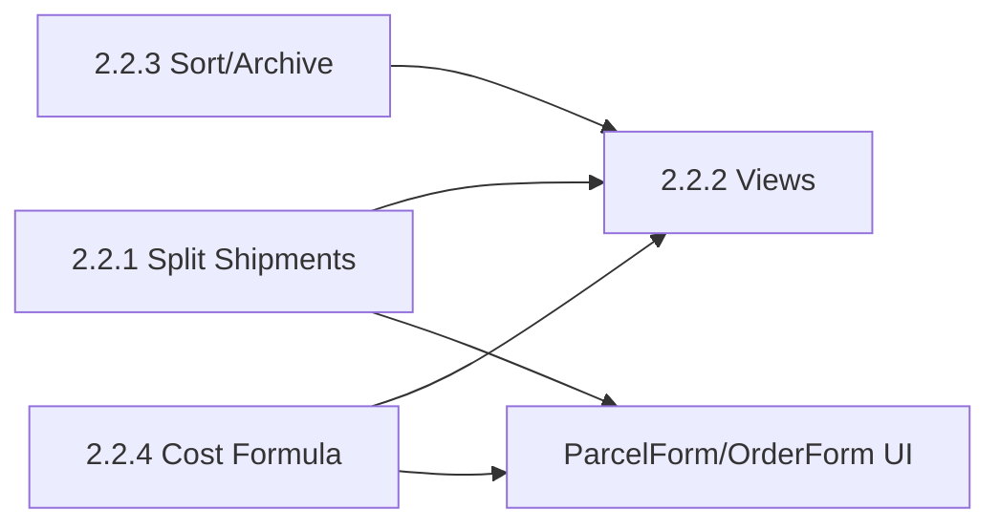

# План спринта 2.2 — Advanced Features & UX

**Проект:** BM Smart Parcel Tracker  
**Спринт:** 2.2  
**Длительность:** 3–4 недели (15–20 рабочих дней)  
**Фокус:** Split shipments (ParcelItem), несколько видов Dashboard, сортировка/архив, формула стоимости заказа  
**Статус:** 🚧 В работе (частично выполнен)  
**Предыдущий спринт:** 2.1 — ✅ COMPLETED (CRUD формы, Currency, Navigation, Summary cards)  
**Детальный пошаговый план:** [ROADMAP_sprint-2.2-DETAILED.md](./ROADMAP_sprint-2.2-DETAILED.md)

---

## Контекст

### Что уже есть после 2.1

- **Backend:** Order, Parcel, OrderItem с `quantity_received`; Currency (CBR); 27+ тестов.
- **Frontend:** AppLayout, OrderForm, ParcelForm, OrderItem inline, Summary cards, MasterTable с expand.
- **Ограничение:** один товар привязан к одной посылке через `quantity_received` — нет корректного split по нескольким посылкам.

### Цели спринта 2.2

1. **Split shipments:** один товар может быть в нескольких посылках (ParcelItem junction).
2. **Несколько видов Dashboard:** по заказам / по посылкам / по товарам / по статусу.
3. **Сортировка, удаление, архивирование** заказов и посылок.
4. **Формула стоимости заказа:** товары + доставка + пошлина, breakdown в UI.

### Критерии успеха спринта

- [x] Пользователь может распределить один товар по нескольким посылкам (разные количества).
- [ ] В Dashboard доступны 4 вида: Заказы, Посылки, Товары, Статус — реализованы 3 вида (Заказы, Посылки, Товары).
- [x] Работают сортировка по колонкам, удаление с подтверждением, архивирование и переключатель «Показать архив».
- [x] В заказе отображается разбивка: товары + доставка + пошлина = итого.
- [ ] **Статусы позиций заказа:** полный набор (Ждёт оплаты, Проверка оплаты, В сборке, Частично отправлено, Отправлено, Частично получено, Получено, Потеряно, Заказ отменён); при смене статуса посылки (Доставлена / Потеряна) связанные позиции заказа автоматически обновляются; в UI статусы отображаются и при необходимости редактируются вручную.
- [x] Все изменения покрыты тестами (pytest), 0 ошибок линтера (ruff, eslint).

---

## Порядок выполнения и зависимости



**Рекомендуемый порядок:**  
Неделя 1 — Task 2.2.1 (ParcelItem) + начало 2.2.4 (модель/миграции).  
Неделя 2 — Task 2.2.3 (is_archived, sort, delete/archive) + завершение 2.2.4 (UI) + Task 2.2.7 (статусы и синхронизация с посылками).  
Неделя 3–4 — Task 2.2.2 (все 4 view) + тесты и полировка.

**Task 2.2.7 (статусы заказа/позиций):** полный набор статусов позиции заказа (Ждёт оплаты, Проверка оплаты, В сборке, Частично отправлено, Отправлено, Частично получено, Получено, Потеряно, Заказ отменён); автообновление статусов позиций при смене статуса посылки (Доставлена → Received/Partially_Received, Потеряна → Lost). Детали — в [ROADMAP_sprint-2.2-DETAILED.md](./ROADMAP_sprint-2.2-DETAILED.md) (задача 2.2.7).

---

## Неделя 1: Split Shipments + основа формулы стоимости

### Task 2.2.1: Рефакторинг Split Shipments (ParcelItem)

**Цель:** Связь many-to-many OrderItem ↔ Parcel через таблицу ParcelItem (один товар — в нескольких посылках с разным количеством).

**Схема БД:**

```sql
CREATE TABLE parcel_items (
    id UUID PRIMARY KEY DEFAULT gen_random_uuid(),
    parcel_id UUID NOT NULL REFERENCES parcels(id) ON DELETE CASCADE,
    order_item_id UUID NOT NULL REFERENCES order_items(id) ON DELETE CASCADE,
    quantity INT NOT NULL CHECK (quantity > 0),
    created_at TIMESTAMPTZ DEFAULT NOW(),
    updated_at TIMESTAMPTZ DEFAULT NOW(),
    UNIQUE(parcel_id, order_item_id)
);
```

**Backend (оценка: 2–3 дня):**

| Шаг | Файл | Действие |
|-----|------|----------|
| 1 | `backend/app/models/parcel_item.py` | Новый модель ParcelItem (id, parcel_id, order_item_id, quantity, TimestampMixin). |
| 2 | `backend/app/models/parcel.py` | Relationship к ParcelItem. |
| 3 | `backend/app/models/order_item.py` | Relationship к ParcelItem. |
| 4 | `backend/alembic/versions/004_add_parcel_items.py` | Миграция: создание таблицы parcel_items. |
| 5 | `backend/app/schemas/parcel_item.py` | ParcelItemCreate, ParcelItemRead, ParcelItemUpdate. |
| 6 | `backend/app/services/parcel_item_service.py` | CRUD для ParcelItem (create/update/delete/list by parcel). |
| 7 | `backend/app/api/parcel_items.py` | Endpoints: POST/GET/PUT/DELETE для parcel_items (или вложенные в parcels). |
| 8 | `backend/app/services/parcel_service.py` | При создании/обновлении посылки принимать список items с quantity. |
| 9 | Решение по `quantity_received` | Вариант A: оставить для обратной совместимости и считать как sum(parcel_items.quantity). Вариант B: убрать в отдельной миграции после переезда UI. |

**Frontend (оценка: 1–2 дня):**

| Шаг | Файл | Действие |
|-----|------|----------|
| 1 | `frontend/src/types/index.ts` | Типы ParcelItem, ParcelWithItems. |
| 2 | `frontend/src/hooks/useParcelItems.ts` | createParcelItem, updateParcelItem, deleteParcelItem (или через useParcels). |
| 3 | `frontend/src/pages/ParcelForm.tsx` | Выбор товаров заказа + количество в этой посылке (вместо/в дополнение к текущему quantity_received). |
| 4 | `frontend/src/pages/DesktopDashboard.tsx` / `MasterTable.tsx` | Отображение «Товар X: посылка 1 (2 шт), посылка 2 (1 шт)». |

**DoD Task 2.2.1:**

- [x] Таблица `parcel_items` создана миграцией 004.
- [x] API позволяет привязывать order_item к parcel с quantity.
- [x] В ParcelForm можно указать несколько товаров и количество в посылке (frontend).
- [x] В Dashboard видно распределение товара по посылкам (frontend).
- [x] Есть минимум 2–3 pytest на parcel_item (create, list, constraint).

---

### Task 2.2.4 (часть 1): Поля доставки и пошлины в Order

**Цель:** Заложить модель и API для формулы «итого = товары + доставка + пошлина».

**Backend (оценка: 1 день):**

| Шаг | Файл | Действие |
|-----|------|----------|
| 1 | `backend/alembic/versions/005_add_shipping_customs_costs.py` | ADD COLUMN shipping_cost, customs_cost (NUMERIC(10,2), nullable) в orders. |
| 2 | `backend/app/models/order.py` | Поля shipping_cost, customs_cost; property total_items_cost (sum item price*quantity); property total_order_cost. |
| 3 | `backend/app/schemas/order.py` | OrderCreate/OrderUpdate/OrderRead — добавить shipping_cost, customs_cost; в Read — опционально total_order_cost. |
| 4 | `backend/app/services/order_service.py` | При create/update принимать и сохранять shipping_cost, customs_cost. |

**DoD (часть 1):**

- [x] Миграция 005 применена.
- [x] Order имеет shipping_cost, customs_cost и computed total (в коде или в API response).
- [x] Тесты на create/update order с новыми полями (существующие тесты проходят).

---

## Неделя 2: Архивирование, сортировка, удаление + UI стоимости

### Task 2.2.3: Сортировка, удаление, архивирование

**Цель:** Сортировка по колонкам, удаление с подтверждением, мягкое архивирование (is_archived).

**Backend (оценка: 1 день):**

| Шаг | Файл | Действие |
|-----|------|----------|
| 1 | `backend/alembic/versions/012_add_is_archived_to_orders_and_parcels.py` | ADD COLUMN is_archived (006 уже занята под deleted_at). |
| 2 | `backend/app/models/order.py`, `backend/app/models/parcel.py` | Поле is_archived. |
| 3 | `backend/app/schemas/order.py`, `parcel.py` | Поле is_archived в Read/Update. |
| 4 | `backend/app/services/order_service.py`, `parcel_service.py` | list_orders/list_parcels по умолчанию фильтруют is_archived=False; опциональный query-параметр include_archived. |
| 5 | `backend/app/api/orders.py`, `parcels.py` | Query-параметр include_archived; PATCH/DELETE для archive (или отдельный endpoint). |

**Frontend (оценка: 1.5–2 дня):**

| Шаг | Файл | Действие |
|-----|------|----------|
| 1 | `frontend/src/pages/DesktopDashboard.tsx` | State: sortBy, sortDirection; передавать в API или сортировать на клиенте; toggle «Показать архив» (include_archived). |
| 2 | `frontend/src/components/MasterTable.tsx` | Клик по заголовку колонки → сортировка, индикатор ▲/▼. |
| 3 | Кнопки в строках | Иконка корзины → модальное подтверждение → DELETE. Кнопка «В архив» → PATCH is_archived=true. |
| 4 | Фильтр | «Показать архив» — перезапрос списка с include_archived=true. |

**DoD Task 2.2.3:**

- [x] В списках по умолчанию не показываются архивированные.
- [x] Есть переключатель «Показать архив» и кнопка «В архив».
- [x] Удаление с подтверждением, после удаления список обновляется.
- [x] Сортировка по выбранной колонке с визуальным индикатором.
- [x] Тесты: list с include_archived, archive order/parcel.

---

### Task 2.2.4 (часть 2): UI формулы стоимости

**Frontend (оценка: 0.5–1 день):**

| Шаг | Файл | Действие |
|-----|------|----------|
| 1 | `frontend/src/pages/OrderForm.tsx` | Поля «Доставка», «Пошлина»; блок «Итого: товары + доставка + пошлина». |
| 2 | `frontend/src/pages/DesktopDashboard.tsx` / MasterTable | В деталях заказа показывать breakdown (товары / доставка / пошлина / итого). |

**DoD Task 2.2.4 (полностью):**

- [x] В OrderForm ввод shipping_cost и customs_cost, отображается итого.
- [x] В Dashboard отображается полная стоимость заказа (breakdown где уместно).

---

## Неделя 3–4: Множественные виды Dashboard + тесты

### Task 2.2.2: Множественные Dashboard Views

**Цель:** Четыре режима отображения: по заказам, по посылкам, по товарам, по статусу.

**Views:**

1. **По заказам (By Orders)** — текущий вид по умолчанию (order-centric, expand items).
2. **По посылкам (By Parcels)** — parcel-centric: трек, статус, вес, вложенные товары.
3. **По товарам (By Items)** — плоский список order_items: название, заказ, посылки, статус.
4. **По статусу (By Status)** — группировка по delivery status (Kanban-подобно).

**Frontend (оценка: 2–3 дня):**

| Шаг | Файл | Действие |
|-----|------|----------|
| 1 | `frontend/src/pages/DesktopDashboard.tsx` | Tab/кнопки: [Заказы] [Посылки] [Товары] [Статус]; state currentView. |
| 2 | Трансформация данных | useMemo для каждого view: ordersView, parcelsView, itemsView (flat), statusGroups. |
| 3 | MasterTable или отдельные компоненты | Разные конфиги колонок для каждого view; для «По статусу» — группы (колонки или карточки). |
| 4 | API | При необходимости: GET /api/orders?include_items=true, GET /api/parcels (уже есть); items view строится из orders/parcels на клиенте или отдельный endpoint. |

**DoD Task 2.2.2:**

- [x] Переключатель видов виден и работает (Заказы, Посылки, Товары).
- [x] Вид «По посылкам» показывает посылки с вложенными товарами.
- [x] Вид «По товарам» показывает плоский список товаров с заказом и посылками.
- [ ] Вид «По статусу» (отдельный таб) — в планах; пока группировка по статусу доступна внутри видов Посылки/Товары.

---

### Финальная неделя: Тесты и полировка

**Backend:**

- `backend/tests/test_parcel_items.py`: create, list, unique constraint, delete.
- `backend/tests/test_orders.py` / `test_parcels.py`: is_archived filter, include_archived, archive.
- `backend/tests/test_orders.py`: order с shipping_cost, customs_cost, проверка total.

**Frontend:**

- Ручная проверка всех 4 view, сортировки, архива, удаления, формулы стоимости.
- При наличии Vitest — базовые снимки или smoke-тесты по желанию.

**CI:**

- Убедиться, что новые тесты запускаются в CI; целевой объём: ≥ 35 backend-тестов.

---

## Сводка по файлам

### Новые файлы

- `backend/app/models/parcel_item.py`
- `backend/app/schemas/parcel_item.py`
- `backend/app/services/parcel_item_service.py`
- `backend/app/api/parcel_items.py` (или вложенные в parcels)
- `backend/alembic/versions/004_add_parcel_items.py`
- `backend/alembic/versions/005_add_shipping_customs_costs.py`
- `backend/alembic/versions/012_add_is_archived_to_orders_and_parcels.py`
- `frontend/src/hooks/useParcelItems.ts` (при необходимости)
- `backend/tests/test_parcel_items.py`

### Изменяемые файлы

- `backend/app/models/order.py` — shipping_cost, customs_cost, total_order_cost; is_archived.
- `backend/app/models/parcel.py` — is_archived; relationship parcel_items.
- `backend/app/models/order_item.py` — relationship parcel_items.
- `backend/app/schemas/order.py`, `parcel.py` — новые поля.
- `backend/app/services/order_service.py`, `parcel_service.py` — логика и фильтры.
- `backend/app/api/orders.py`, `parcels.py` — query-параметры, archive.
- `frontend/src/pages/ParcelForm.tsx` — работа с ParcelItem.
- `frontend/src/pages/OrderForm.tsx` — доставка/пошлина и итого.
- `frontend/src/pages/DesktopDashboard.tsx` — 4 view, sort, archive, «Показать архив».
- `frontend/src/components/MasterTable.tsx` — сортировка по заголовкам, кнопки удаления/архива.
- `frontend/src/types/index.ts` — ParcelItem, архивы, сортировка.

---

## Риски и митигации

| Риск | Вероятность | Митигация |
|------|-------------|-----------|
| Миграция ParcelItem ломает текущий ParcelForm (quantity_received) | Средняя | Сохранить quantity_received как derived (sum parcel_items) или миграция данных; поэтапный переход UI. |
| Четыре view раздувают DesktopDashboard | Средняя | Вынести преобразования данных и конфиги таблиц в отдельные функции/файлы. |
| Разные API для sort/archive на backend | Низкая | Сортировка пока на клиенте; при росте данных добавить sort/order_by в API. |

---

## После спринта 2.2

**Готово:**

- Split shipments через ParcelItem.
- Четыре вида Dashboard.
- Сортировка, удаление, архивирование.
- Формула стоимости заказа с доставкой и пошлиной.

**Дальше (следующие спринты):**

- LLM Vision Import (перенесён с 2.1).
- Tracking queue (Redis/Celery), уведомления о protection deadline.
- PWA, офлайн, сканер штрихкодов.
- Frontend-тесты (Vitest), мониторинг (Sentry и т.п.).

---

**Документ:** План спринта 2.2  
**Версия:** 1.0  
**Дата:** 14 февраля 2026
