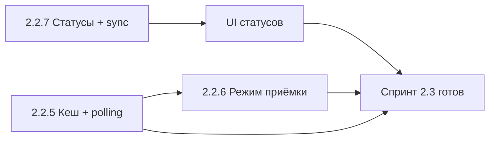

# План спринта 2.3 — Завершение 2.2 и приёмка

**Проект:** BM Smart Parcel Tracker  
**Спринт:** 2.3  
**Длительность:** 3–4 недели (15–20 рабочих дней)  
**Фокус:** Главная бизнес-фича — сканирование QR/штрихкода в панели поиска; затем кеш/обновление, режим приёмки, синхронизация статусов позиций. Вид «По статусу» отменён — вместо него реализована группировка во всех видах Dashboard.  
**Статус:** 📋 Запланирован  
**Предыдущий спринт:** 2.2 — 🚧 частично выполнен (Split, 3 view, сортировка, архив, формула стоимости)  
**Ссылки:** [ROADMAP_now.md](./ROADMAP_now.md), [ROADMAP_sprint-2.2.md](./ROADMAP_sprint-2.2.md), [ROADMAP_sprint-2.2-DETAILED.md](./ROADMAP_sprint-2.2-DETAILED.md)

---

## Контекст

### Что уже сделано в 2.2

- ✅ Task 2.2.1: Split shipments (ParcelItem junction, ParcelForm, Dashboard)
- ✅ Task 2.2.3: Сортировка, удаление, архивирование (is_archived, «Показать архив»)
- ✅ Task 2.2.4: Формула стоимости заказа (shipping_cost, customs_cost, breakdown в OrderForm и Dashboard)
- ✅ Task 2.2.2: Три вида Dashboard (Заказы, Посылки, Товары) с **группировкой во всех видах**; отдельный вид «По статусу» не реализовывали — решено отказаться в пользу группировки.

### Старт спринта: главная бизнес-фича ✅

| № | Задача | Статус |
|---|--------|--------|
| 0 | **Сканирование QR/штрихкода в панели поиска** | ✅ Реализовано: кнопка 📷 рядом с полем поиска на Dashboard; камера + загрузка фото; результат подставляется в поиск (по трек-номеру и др.). |

### Что осталось (объём спринта 2.3)

| № | Задача | Приоритет | Оценка |
|---|--------|-----------|--------|
| 1 | **2.2.7** Статусы позиций заказа и синхронизация с посылками | Высокий | 2–3 дня |
| 2 | **2.2.5** Client cache и polling (обновление по запросу / раз в N мин) | Средний | 1–2 дня |
| 3 | **2.2.6** Режим приёмки: mark-received, поиск по кешу, страница «Приёмка» | Средний | 2–3 дня |

---

## Цели спринта 2.3

1. **Статусы и синхронизация:** при смене статуса посылки на «Доставлена» или «Потеряна» связанные позиции заказа автоматически обновляются (quantity_received, item_status); в enum добавлен Lost; в UI отображаются и редактируются все статусы.
2. **Dashboard:** три вида (Заказы, Посылки, Товары) с группировкой во всех видах (отдельный вид «По статусу» не делаем).
3. **Актуальные данные:** кнопка «Обновить», опционально pull-to-refresh и/или автообновление раз в N минут; единый слой загрузки списков.
4. **Сканирование в поиске:** QR/штрихкод в панели поиска Dashboard (камера + загрузка фото) — результат подставляется в поле поиска. ✅ Сделано.
5. **Режим приёмки:** страница «Приёмка», поиск посылки по трек-номеру по кешу, отметка «получена» (mark-received).

### Критерии успеха

- [ ] При смене посылки на Delivered: у связанных order_items обновляются quantity_received и item_status (Received / Partially_Received).
- [ ] При смене посылки на Lost: у связанных order_items item_status = Lost.
- [ ] В enum OrderItemStatus есть Lost; в UI отображается «Потеряно»; ручное редактирование статуса позиции возможно.
- [ ] В Dashboard три вида с группировкой (Заказы, Посылки, Товары).
- [ ] Есть кнопка «Обновить» и опционально автообновление списков раз в N минут.
- [x] В панели поиска Dashboard: кнопка сканирования QR/штрихкода; результат подставляется в поиск (по трек-номеру и др.).
- [ ] Режим приёмки: ввод/сканирование трек-номера → поиск по кешу → mark-received; backend endpoint POST /parcels/{id}/mark-received.
- [ ] Все изменения покрыты тестами (pytest); 0 ошибок линтера (ruff, eslint).

---

## Порядок выполнения и зависимости

**Рекомендуемый порядок:**  
**Старт спринта:** Сканирование QR/штрихкода в панели поиска — ✅ реализовано (кнопка 📷, камера + файл, результат в поиск).  
**Неделя 1:** Task 2.2.7 (Backend: Lost + sync при Delivered/Lost; Frontend: типы, подписи, отображение).  
**Неделя 2:** Task 2.2.5 (централизованный refetch, кнопка «Обновить», опционально интервал).  
**Неделя 3:** Task 2.2.6 (Backend: mark-received; Frontend: страница «Приёмка», поиск по кешу, вызов mark-received).  
**Неделя 4:** Тесты, полировка, обновление ROADMAP.

---

## Неделя 1: Статусы позиций и синхронизация с посылками (2.2.7)

### Backend

| Шаг | Файл | Действие |
|-----|------|----------|
| 1 | `backend/app/models/enums.py` | Добавить `Lost = "Lost"` в `OrderItemStatus`. |
| 2 | `backend/alembic/versions/013_add_order_item_status_lost.py` | Миграция: `ALTER TYPE orderitemstatus ADD VALUE IF NOT EXISTS 'Lost'`. |
| 3 | `backend/app/services/parcel_service.py` (или `order_item_status_sync.py`) | После `update_parcel`: при смене status на **Delivered** — по parcel_items увеличить у order_item `quantity_received` на quantity, выставить item_status = Received или Partially_Received; при **Lost** — выставить item_status = Lost для связанных order_items. |
| 4 | `backend/app/schemas/order_item.py` | Убедиться, что в валидации допускается `Lost`. |

**DoD Backend 2.2.7:**  
- [ ] Enum Lost, миграция 013 применена.  
- [ ] При PUT посылки status=Delivered: связанные order_items обновляют quantity_received и item_status.  
- [ ] При PUT посылки status=Lost: связанные order_items → item_status=Lost.  
- [ ] Тесты: создание заказа+позиции+посылки+parcel_item; update parcel на Delivered/Lost — проверка order_item.

### Frontend

| Шаг | Файл | Действие |
|-----|------|----------|
| 1 | `frontend/src/types/index.ts` | Добавить `'Lost'` в `OrderItemStatus`; в `ORDER_ITEM_STATUS_LABELS`: `Lost: 'Потеряно'`. |
| 2 | `frontend/src/pages/DesktopDashboard.tsx` | Для статуса Lost отображать «Потеряно» (через ORDER_ITEM_STATUS_LABELS). |
| 3 | `frontend/src/pages/OrderForm.tsx` (или компонент позиции) | Выбор статуса позиции из списка (включая Lost, Cancelled и остальные). |

**DoD Frontend 2.2.7:**  
- [ ] В карточке заказа и в видах Dashboard статус «Потеряно» отображается.  
- [ ] Ручное редактирование статуса позиции (в т.ч. Потеряно, Заказ отменён) возможно.

---

## Неделя 2: Кеш и обновление (2.2.5)

> **Примечание:** Отдельный вид «По статусу» не реализуем — вместо него во всех трёх видах Dashboard (Заказы, Посылки, Товары) используется группировка. Task 2.2.2 считается выполненным в этом варианте.

### Task 2.2.5: Client cache и polling

**Цель:** Единый слой загрузки списков (orders с items, parcels); обновление по кнопке «Обновить» и опционально раз в N минут (только когда экран в foreground).

**Файлы:**  
- `frontend/src/hooks/useOrders.ts`, `useParcels.ts`: refetch при фокусе окна (опционально), явный refetch после мутаций.  
- `frontend/src/pages/DesktopDashboard.tsx`: кнопка «Обновить» (вызов refetch orders + parcels); опционально `setInterval(refetch, 2*60*1000)` при монтировании, очистка при unmount.  
- Документировать стратегию в коде или в System Design.

**DoD:**  
- [ ] Кнопка «Обновить» перезапрашивает списки заказов и посылок.  
- [ ] После создания/редактирования/удаления/архива список обновляется (refetch или инвалидация).  
- [ ] Опционально: автообновление раз в 2–5 минут при открытом дашборде.

---

## Неделя 3: Режим приёмки (2.2.6)

### Backend

| Шаг | Файл | Действие |
|-----|------|----------|
| 1 | `backend/app/services/parcel_service.py` | Функция `mark_parcel_received(db, parcel_id, user_id)`: установить status=Delivered; вызвать ту же логику синхронизации, что и при update_parcel на Delivered (quantity_received, item_status у связанных order_items). |
| 2 | `backend/app/api/parcels.py` | Endpoint `POST /api/parcels/{id}/mark-received` (auth); проверка владельца; вызов `mark_parcel_received`. |

**DoD Backend:**  
- [ ] POST /parcels/{id}/mark-received переводит посылку в Delivered и обновляет связанные order_items.  
- [ ] Тест: mark-received → parcel.status=Delivered, order_item.quantity_received и item_status обновлены.

### Frontend

| Шаг | Файл | Действие |
|-----|------|----------|
| 1 | Страница «Приёмка» | Новая страница (например `/receive`), маршрут в App.tsx, ссылка в AppLayout. |
| 2 | Логика | Поле ввода трек-номера (Enter или кнопка); поиск по уже загруженному кешу посылок (parcels из useParcels); при совпадении — показать карточку посылки и кнопку «Отметить полученной». |
| 3 | API | Вызов POST /parcels/{id}/mark-received; после успеха — refetch parcels/orders и показать «Принято в этой сессии» (локальный state). |

**DoD Frontend:**  
- [ ] Пользователь открывает «Приёмка», вводит трек-номер, посылка ищется по кешу и помечается полученной.  
- [ ] Товары в заказе синхронизируются (отображаются обновлённые quantity_received и item_status после refetch).

---

## Неделя 4: Тесты, полировка

### Сканер QR/штрихкода

**Статус:** ✅ Реализован в панели поиска Dashboard (главная бизнес-фича). Кнопка 📷 рядом с полем поиска; камера + загрузка фото; распознанный текст подставляется в поиск (трек-номер и др.). На странице «Приёмка» (Task 2.2.6) можно переиспользовать тот же компонент `BarcodeScannerModal`.

### Тесты и CI

- **Backend:** тесты 2.2.7 (sync при Delivered/Lost), тест mark-received; целевой объём ≥ 38 pytest.  
- **Frontend:** ESLint, tsc без ошибок; ручная проверка всех 4 видов, приёмки, статусов.  
- **CI:** все шаги в `.github/workflows/ci.yml` проходят.

---

## Сводка по файлам

### Новые файлы

- `frontend/src/components/BarcodeScannerModal.tsx` — модальное окно сканирования QR/штрихкода (камера + загрузка фото). ✅ Добавлено.
- `backend/alembic/versions/013_add_order_item_status_lost.py`
- `frontend/src/pages/Receive.tsx` (или `ReceivePage.tsx`) — страница приёмки
- При необходимости: `backend/app/services/order_item_status_sync.py` (если логику выносят из parcel_service)
- При необходимости: `backend/tests/test_order_item_status_sync.py`

### Изменяемые файлы

- `backend/app/models/enums.py` — Lost в OrderItemStatus
- `backend/app/services/parcel_service.py` — sync при update status; mark_parcel_received
- `backend/app/api/parcels.py` — POST mark-received
- `frontend/src/types/index.ts` — Lost, подписи
- `frontend/src/pages/DesktopDashboard.tsx` — кнопка сканера 📷 в панели поиска, кнопка «Обновить», опционально интервал (группировка во всех видах уже реализована)
- `frontend/src/pages/OrderForm.tsx` — выбор статуса позиции (включая Lost)
- `frontend/src/App.tsx` — маршрут /receive
- `frontend/src/components/AppLayout.tsx` — ссылка «Приёмка»
- `frontend/src/hooks/useParcels.ts` / `useOrders.ts` — refetch, опционально передача данных в контекст для кеша

---

## Риски и митигации

| Риск | Митигация |
|------|-----------|
| Синхронизация при Lost в split-посылках (часть в одной, часть в другой) | Упрощённое правило: при Lost по всем order_item из parcel_items этой посылки выставить Lost; при необходимости позже уточнить «только если вся позиция в потерянных посылках». |
| Сканер на мобильных (разрешения камеры) | Graceful degradation: без камеры доступен только ручной ввод трек-номера. |
| Кеш и автообновление — дублирование запросов | Один источник правды (хуки), refetch при явном действии и по таймеру только на активном экране. |

---

## После спринта 2.3

**Готово:**  
- Полный набор статусов позиций заказа и автосинхронизация с посылками (Delivered/Lost).  
- Четыре вида Dashboard (Заказы, Посылки, Товары, Статус).  
- Обновление данных по запросу и опционально по таймеру.  
- Режим приёмки: поиск по трек-номеру по кешу, mark-received; опционально сканер.

**Дальше (бэклог):**  
- LLM Vision Import (перенесён с 2.1).  
- Tracking queue (Redis/Celery), уведомления о protection deadline.  
- PWA, офлайн, расширенный офлайн-режим.  
- Frontend-тесты (Vitest), мониторинг (Sentry).  

---

**Документ:** План спринта 2.3  
**Версия:** 1.0  
**Дата:** 15 февраля 2026
